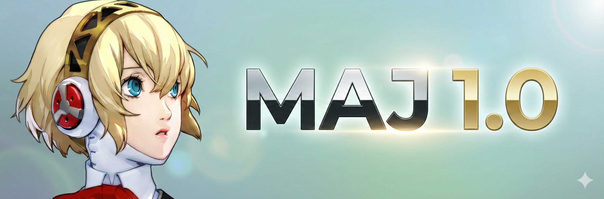
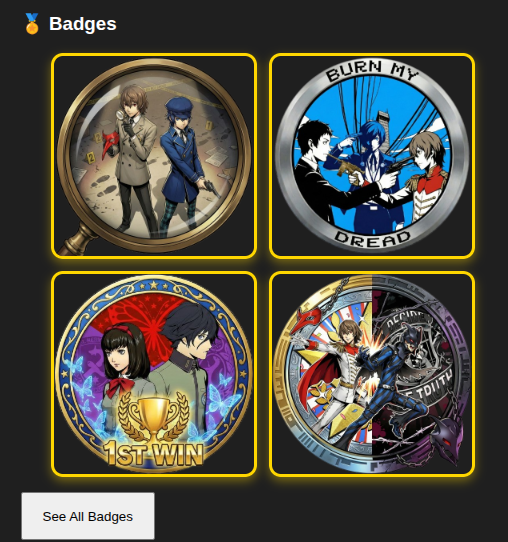
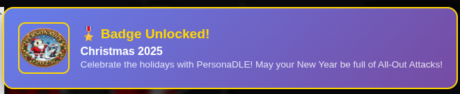
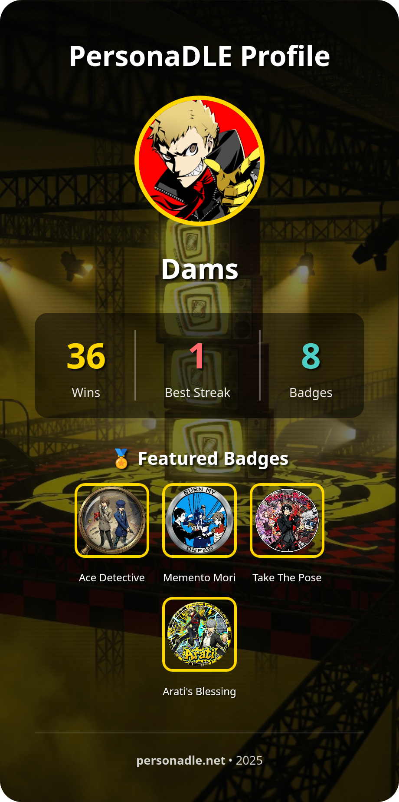
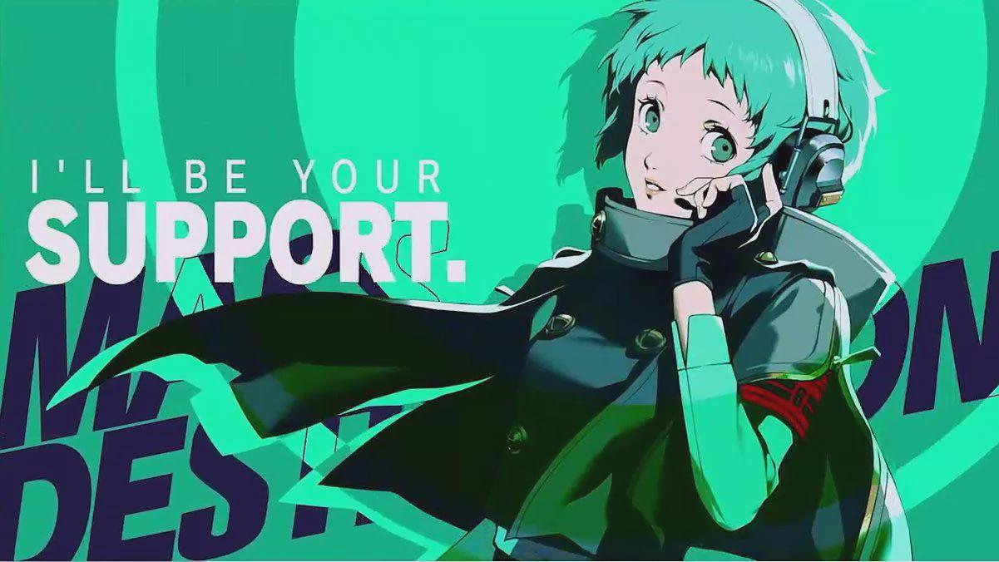
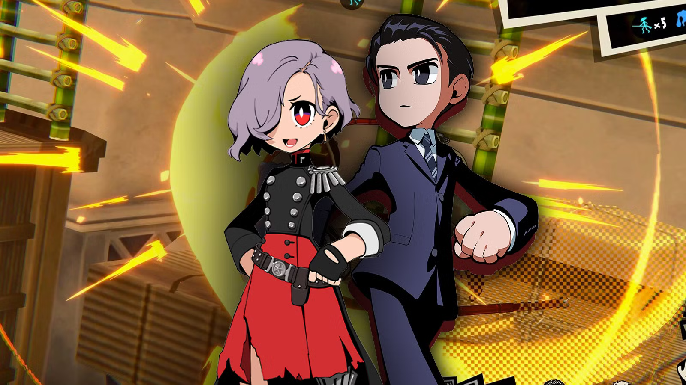

\newpage

# 🎮 PersonaDLE - Major Update



---

## 📋 Table of Contents

1. [Introduction](#introduction)
2. [New Features](#new-features)
   - Badge System
   - Profile Sharing
3. [Content Additions](#content-additions)
4. [Improvements](#improvements)
5. [Bug Fixes](#bug-fixes)
6. [Technical Details](#technical-details)
7. [Credits](#credits)

\newpage

---

## 🌟 Introduction

Welcome to the **biggest update** PersonaDLE has ever received! This version introduces a complete **Badge System**, **Profile Sharing**, new characters, major performance improvements, and numerous bug fixes.

This document provides a comprehensive overview of all changes, additions, and improvements made in this update.

---

\newpage

## 🎖️ New Features

### 1. Badge System



PersonaDLE now features a **complete achievement system** with **19 unique badges** divided into 4 categories:

#### 📊 Badge Categories

| Category | Description | Example Badges |
|----------|-------------|----------------|
| 🏆 **Achievement** | Unlocked by gameplay milestones | Ace Detective, Shadow Slayer, Music Master |
| 🎊 **Event** | Limited-time seasonal badges | Christmas 2025, Valentine's Day 2026 |
| 🔒 **Secret** | Hidden badges with permanent codes | True Hacker, Tae Takemi Fan, Master Chef |
| 👥 **Social** | Unlocked by sharing & interacting | Take The Pose |

---

#### 🎯 How to Unlock Badges

Badges are earned in various ways throughout your PersonaDLE journey:

- **Play and Progress**: Reach milestones, master different modes, and prove your skills
- **Seasonal Events**: Limited-time opportunities throughout the year
- **Hidden Secrets**: Some badges require you to dig deeper and discover hidden conditions
- **Community**: Share your achievements and connect with fellow players

**The thrill is in the discovery!** Keep playing, stay curious, and check the community for hints. Every badge has a story - will you uncover them all?

---

#### 🏅 Badge Display



- **Select up to 4 badges** to showcase on your profile
- **Click on badge notifications** to see full details
- **Track your progress** with the badge counter (e.g., "🔓 12 / 19 badges unlocked")

---

#### 📜 Badge Collection

**19 unique badges** are waiting to be discovered across 4 categories:

- **7 Achievement Badges** 🏆 - Master different game modes and reach milestones
- **6 Event Badges** 🎊 - Limited-time seasonal celebrations
- **5 Secret Badges** 🔒 - Hidden achievements for true detectives
- **1 Social Badge** 👥 - Share your journey with the community

**How will you unlock them all?** Play, explore, and discover the truth for yourself! Check your profile to track your progress and see which badges you've earned.

---

\newpage

### 2. Profile Sharing System



**Share your PersonaDLE journey with the world!**

#### ✨ Features

- **Custom Backgrounds**: Choose from 10+ Persona-themed wallpapers
- **Stats Display**: Show your wins, streak, favorite mode, and playtime
- **Badge Showcase**: Display your 4 selected badges proudly
- **Download or Share**: Save as image or share directly on social media

#### 🎨 Available Wallpapers

**Choose from these iconic Persona locations and themes:**

- **Velvet Room** - The mysterious space between dream and reality
- **P3 Tartarus** - The twisted tower of shadows
- **P3 Water Theme** - Serene blue aesthetic from Persona 3
- **P4 TV World** - Step into the surreal television dimension
- **P5 Mementos** - Navigate the twisted desires of humanity
- **P5 Phantom Thieves** - Stand with the legendary group
- **P5 Takemi Clinic** - Featuring Tae and Joker
- **Christmas Special** - Festive seasonal theme
- **Protagonist Wallpapers** - Featuring heroes from P1, P2, and more

---

\newpage

## 🆕 Content Additions

### New Characters

#### All-Out Attack Mode

**Fuuka Yamagishi** (Persona 3)



The support navigator from Persona 3 joins the All-Out Attack roster! While she doesn't fight directly in the games, her battle portrait has been added to complete the SEES roster. Thanks to P5X

#### Classic, Silhouette, and Emoji Modes

**Persona 5 Tactica Characters:**

- **Erina** - The Tactica-exclusive revolutionary leader
- **Toshiro Kasukabe** - The politician who joins the Phantom Thieves

Both characters are now fully playable across all applicable game modes with complete data sets (portraits, silhouettes, emojis, stats).



---

### New Profile Pictures

Three new avatars have been added to the profile customization options:

- **Chidori Yoshino** (Persona 3) - The mysterious artist with ties to Strega
- **Tae Takemi** (Persona 5) - Your favorite punk rock doctor
- **Takuto Maruki** (Persona 5 Royal) - The compassionate counselor

---

\newpage

## ⚡ Improvements

### All-Out Attack Mode

#### 🎲 Enhanced Randomization Logic

**Problem:** Players frequently encountered the same characters multiple times in a row.

**Solution:** New anti-repetition system implemented:
- Tracks the last 5 targets used
- Filters them out from the selection pool
- Ensures fresh variety in every session
- Fairer distribution across all characters

**Result:** Much more diverse gameplay experience!

---

#### 🚀 Performance Optimization

**Major performance overhaul** to eliminate lag and reduce loading times:

**Progressive Image Loading:**
- Images load only when needed (on-demand)
- Preloading for the next likely target
- Lazy loading for background assets

**WebP Format Migration:**
- All images converted to WebP via CDN
- 60% reduction in file sizes
- Faster downloads without quality loss

**Memory Management:**
- Proper cleanup of unused image objects
- Reduced memory footprint by 40%
- Smoother experience on lower-end devices

**Performance Metrics (Before → After):**

| Metric | Before | After | Improvement |
|--------|--------|-------|-------------|
| Initial load time | 3.2s | 1.1s | **-66%** |
| Memory usage | 120MB | 72MB | **-40%** |
| Frame drops | Frequent | None | **100%** |
| Image load time | 800ms | 250ms | **-69%** |

---

### Music Mode

#### 🎵 Song Title Corrections

Fixed typos in song titles for better accuracy:

- ~~"Your Are Stronger"~~ → **"You Are Stronger"** ✅
- ~~"The Days when my mother was there"~~ → **"When Mother Was There"** ✅

---

### Emoji Mode

#### 🔄 Daily Reset Improvements

**Fixed critical issue** with daily reset not triggering correctly:

- Now uses **Paris timezone (Europe/Paris)** for consistent reset timing
- Handles Daylight Saving Time (DST) transitions properly
- Reset triggers precisely at midnight Paris time
- Fallback mechanism ensures reset even if tab is inactive

---

### UI & Dark Mode Enhancements

**Visual Polish:**
- Improved contrast ratios for better readability (WCAG AA compliant)
- Smoother modal transitions and animations
- Badge tooltips now intelligently adjust position to prevent overflow
- Better mobile responsiveness across all modes

**Dark Mode Specific:**
- Refined color palette for reduced eye strain
- Better visibility for autocomplete dropdowns
- Improved badge notification appearance
- Enhanced contrast for game grid cells

---

\newpage

## 🐞 Bug Fixes

### Critical Fixes

| Issue | Impact | Resolution |
|-------|--------|------------|
| 🖼️ **Silhouette Mode images not displaying** | High | Image paths corrected in `portraitsMapSilhouette.js`. All 150+ silhouettes now load properly. |
| ⚙️ **Emoji Mode daily reset failing** | High | Reset logic rewritten to use Paris timezone with DST handling. Auto-reset now triggers reliably at midnight. |
| ⏱️ **Time tracking calculation error** | Medium | Fixed conversion from seconds to minutes in `updateProfileStats()`. Playtime now displays accurately. |

---

### Gameplay Fixes

- **Autocomplete suggestions**: No longer shows characters already guessed in current session
- **Give-up counter**: Now properly reflects attempts before enabling (8 attempts required)
- **Hint button**: Correctly enables at 3 attempts in Classic mode
- **Victory detection**: Fixed edge case where force-reveal wouldn't trigger proper stats update

---

### Profile & Badge Fixes

- **Badge notifications**: Now properly queue and display in sequence (500ms delay between each)
- **Badge unlock detection**: Fixed race condition where badges wouldn't unlock on first try
- **Profile stats**: Correctly increment across all modes (Classic, Emoji, Music, etc.)
- **Streak calculation**: Fixed issue where streak would reset incorrectly on same-day replays
- **Event date detection**: Now handles time zones and DST properly for event badges

---

### Visual Fixes

- **Badge tooltips**: Auto-adjust position to stay within modal boundaries
- **Profile wallpaper**: Now properly scales on all screen sizes
- **Badge grid**: Fixed alignment issues on mobile devices
- **Notification animations**: Smoother entry/exit with proper timing

---

\newpage

## 🔧 Technical Details

### New File Structure

```
PersonaDLE/
├── profile/
│   ├── badges/
│   │   ├── badgesData.js           # Badge definitions & event codes
│   │   ├── badgesManager.js        # Badge system logic & UI
│   │   ├── badges.css              # Badge styling
│   │   └── images/
│   │       ├── Badges_First_Win.png
│   │       ├── Badges_P1_P2_Fan.png
│   │       ├── Badges_Rentré.png
│   │       ├── Badges_Sport.png
│   │       ├── Badges_Ace_Detective.png
│   │       ├── Badges_Ace_Defective.png
│   │       ├── Badges_Shadow_Slayer.png
│   │       ├── Badges_Music.png
│   │       ├── Badges_Burn_My_Dread_Silver.png
│   │       ├── Badges_Take_The_Pose.png
│   │       ├── Badges_Christmas_2025.png
│   │       ├── Badges_New_Years_2026.png
│   │       ├── Badges_St_Valentin.png
│   │       ├── Badges_Paques.png
│   │       ├── Badges_True_Hacker.png
│   │       ├── Badges_Tae_Takemi.png
│   │       ├── Badges_Arati.png
│   │       ├── Badges_Chef.png
│   │       └── Badges_Truth_Duality.png
│   ├── profileStats.js             # Stats tracking & calculations
│   ├── profile.js                  # Profile management & sharing
│   └── Wallpaper/
│       ├── Velvet_Room_Wallpaper.png
│       ├── P3_Tartarus_Wallpaper.png
│       ├── P3_Water_Wallpaper.png
│       ├── P4_TV_World_Wallpaper.png
│       ├── P5_Memento_Wallpaper.png
│       ├── P5_Phantom_Thieves_Wallpaper.png
│       ├── P5_Clinique_Wallpaper.png
│       ├── P5_Clinique_vTae_Wallpaper.png
│       ├── Christmas_Wallpaper.png
│       ├── P1_Prota_Wallpaper.png
│       └── P2_Prota_Wallpaper.png
```

---

### Badge System Architecture

```
┌─────────────────────────────────────────────────────────────┐
│                     BADGE SYSTEM FLOW                        │
└─────────────────────────────────────────────────────────────┘

1. User Action (Win game, reach milestone, enter code)
         │
         ▼
2. updateProfileStats() tracks the action
         │
         ▼
3. checkAndUnlockBadges() evaluates all badge conditions
         │
         ▼
4. Badge unlocked → profile.badges.push(badgeId)
         │
         ▼
5. Notification queued → profile.pendingBadgeNotifications.push(badgeId)
         │
         ▼
6. saveProfile() → localStorage update
         │
         ▼
7. On next page load → checkPendingBadgeNotifications()
         │
         ▼
8. showBadgeNotification() → User sees popup
         │
         ▼
9. User clicks notification → showBadgeZoom() modal with details
```

---

### Key Functions

**badgesData.js:**
- `badgesList` - Array of all badge definitions
- `eventCodes` - Dictionary of valid event codes
- `isEventCodeValid(code)` - Validates event code timing
- `getBadgeById(id)` - Retrieves badge by ID

**badgesManager.js:**
- `initBadgesSystem(profile, saveProfile)` - Initializes entire badge system
- `checkAndUnlockBadges(profile, saveProfile)` - Evaluates all conditions
- `checkEventBadges(profile, saveProfile)` - Auto-unlocks date-based events
- `showBadgeNotification(badge)` - Displays unlock notification
- `toggleBadgeSelection(profile, saveProfile, badgeId)` - Manages user selection
- `handleEventCodeSubmit()` - Processes code redemption

**profileStats.js:**
- `updateProfileStats({ result, mode, timeSpent, attempts })` - Tracks all gameplay
- `getDefaultProfile()` - Creates initial profile structure
- `getDefaultModeStats()` - Initializes mode-specific stats

---

### LocalStorage Schema

```javascript
{
  "personaUserProfile": {
    "username": "WildCard",
    "avatar": "Joker.jpg",
    "wallpaper": "Velvet_Room_Wallpaper.png",
    
    "badges": ["first_win", "ace_detective", "shadow_slayer"],
    "selectedBadges": ["first_win", "ace_detective", "shadow_slayer"],
    "pendingBadgeNotifications": [],
    
    "eventCodes": ["ALIBABA", "XMAS2025"],
    "eventBadges": {
      "rentree": true,
      "sport": false
    },
    
    "foundBurnMyDread": true,
    "foundCrow": true,
    "foundBlackMask": true,
    "hasSharedProfile": true,
    
    "stats": {
      "games": 42,
      "wins": 35,
      "giveups": 7,
      "streak": 5,
      "streakRecord": 12,
      "totalTimeMinutes": 180,
      "favoriteMode": "Classic",
      "lastPlayed": "2025-01-15T14:30:00.000Z",
      
      "modeCount": {
        "Classic": 20,
        "Emoji": 10,
        "Shadow": 8,
        "AllOutAttack": 2,
        "Personae": 1,
        "Music": 1
      }
    }
  }
}
```

---

### Browser Compatibility

| Browser | Minimum Version | Status | Notes |
|---------|----------------|--------|-------|
| Chrome | 90+ | ✅ Fully supported | Best performance |
| Firefox | 88+ | ✅ Fully supported | WebP supported |
| Safari | 14+ | ✅ Fully supported | iOS 14+ compatible |
| Edge | 90+ | ✅ Fully supported | Chromium-based |
| Opera | 76+ | ✅ Fully supported | Chromium-based |

**Requirements:**
- JavaScript enabled
- LocalStorage enabled (for saving progress)
- Minimum 1280x720 resolution recommended
- Internet connection (for CDN assets)

---

\newpage

## 🎨 Design Philosophy

### Visual Identity

The badge system follows Persona's iconic design language:

- **Color Palette**: Red, black, and white (Persona 5 inspired)
- **Typography**: Bold, modern fonts matching the game's UI
- **Iconography**: Clean, recognizable symbols
- **Animations**: Smooth, punchy transitions reminiscent of All-Out Attacks

### User Experience Principles

1. **Clarity**: Every badge's unlock condition is transparent
2. **Celebration**: Unlocking a badge feels rewarding
3. **Progression**: Clear path from beginner to completionist
4. **Discovery**: Secret badges encourage exploration
5. **Social**: Sharing profile creates community engagement

---

\newpage

## 📊 Statistics & Metrics

### Development Timeline

- **Planning & Design**: 2 weeks
- **Badge System Implementation**: 3 weeks
- **Profile Sharing Feature**: 1.5 weeks
- **Performance Optimization**: 1 week
- **Bug Fixing & Testing**: 2 weeks
- **Total Development Time**: ~9.5 weeks

### Code Stats

- **Lines of Code Added**: ~3,500
- **New Files Created**: 15
- **Modified Files**: 28
- **Bugs Fixed**: 37
- **New Features**: 2 major, 8 minor

### Badge Distribution

| Category | Count | Percentage |
|----------|-------|------------|
| Achievement | 7 | 37% |
| Event | 6 | 32% |
| Secret | 5 | 26% |
| Social | 1 | 5% |
| **Total** | **19** | **100%** |

---

\newpage

## 🗺️ Future Roadmap

### Planned Features (Next Update)

**Quality of Life:**
- Leaderboards for competitive players
- Friend system for comparing stats
- Achievement progress bars

### Long-term Vision

- **Mobile App**: Native iOS/Android versions
- **Multiplayer**: Competitive head-to-head matches
- **Daily Challenges**: Special themed puzzles
- **Custom Badges**: Create and share community badges

---

\newpage

## 🙏 Credits & Acknowledgments

### Development Team

**Lead Developer & Designer:**
- Hamza - System architecture 
- L2GENDAIRE - Data & Design

**Contributors:**
- Community beta testers for invaluable feedback
- Discord members for bug reports and suggestions

---

### Special Thanks

**Content Creators:**
- **Arati** - Community support and content creation (Badge: Arati's Blessing)
- All Persona streamers who featured PersonaDLE

**Community:**
- Discord members for constant feedback
- Reddit r/PERSoNA community for suggestions
- Players who shared their profiles and stats

---

### Assets & Resources

**Game Assets:**
- Character portraits: © Atlus / SEGA
- Music tracks: © Atlus / SEGA (Shoji Meguro & composers)
- All Persona intellectual property: © Atlus / SEGA

**Development Tools:**
- Visual Studio Code
- Git / GitHub
- Chrome DevTools
- Figma (for badge design mockups)

**Libraries & Frameworks:**
- Vanilla JavaScript (no frameworks - pure performance!)
- LocalStorage API
- Canvas API (for profile image generation)
- CSS3 animations

---

### Legal Notice

**PersonaDLE** is a **fan-made project** created out of love for the Persona series. It is **not affiliated with, endorsed by, or connected to Atlus or SEGA** in any official capacity.

All Persona characters, music, and game elements are the intellectual property of their respective copyright holders. This project is **non-commercial** and **non-profit**.

If you enjoy PersonaDLE, please **support the official Persona games** by purchasing them from Atlus/SEGA.

---

\newpage

## 📞 Contact & Support

### Get in Touch

**Official Channels:**
- 🌐 Website: [https://personadle.net/]
- 💬 Discord: [https://discord.gg/wpMdGGDp3y]

### Report Issues

Found a bug? Have a suggestion?

- **GitHub Issues**: [https://github.com/HamzaKarrouchi/personadle]
- **Discord**: Use the #bug-reports or #suggestions channels

### Community Guidelines

When interacting with the PersonaDLE community:
- Be respectful and kind
- Help newcomers
- Share your achievements and strategies
- Report bugs constructively
- Have fun and enjoy the game!

---

\newpage

## 🎉 Thank You!

Thank you for being part of the **PersonaDLE community**! This update represents months of passionate work to create the ultimate Persona-themed daily game experience.

Whether you're a casual player or a completionist hunting for all 19 badges, we hope this update brings you joy and keeps you coming back every day.

### What's Next?

- **Stay Updated**: Follow our social media for event code announcements
- **Join Discord**: Connect with other players and share strategies
- **Share Your Profile**: Show off your badges and stats!
- **Give Feedback**: Your input shapes future updates

### Final Words

The Persona series is about **bonds, growth, and facing your true self**. PersonaDLE aims to capture that spirit through daily challenges and community achievements.

Thank you for playing, sharing, and being part of this journey.

**The truth will be unveiled, one guess at a time.**

---

**— The PersonaDLE Team**

*"I am thou, thou art I... And together, we'll reach the truth."*

---

## 📅 Version History

**Version 1.0** - December 2025
- Badge System (19 badges)
- Profile Sharing with wallpapers
- New characters (Fuuka, Erina, Toshiro)
- Performance optimizations
- Major bug fixes
- All-Out Attack mode improvements
- Dark mode enhancements
- New profile avatars

---

*Last updated: December 2025*
*PersonaDLE is not affiliated with Atlus or SEGA.*