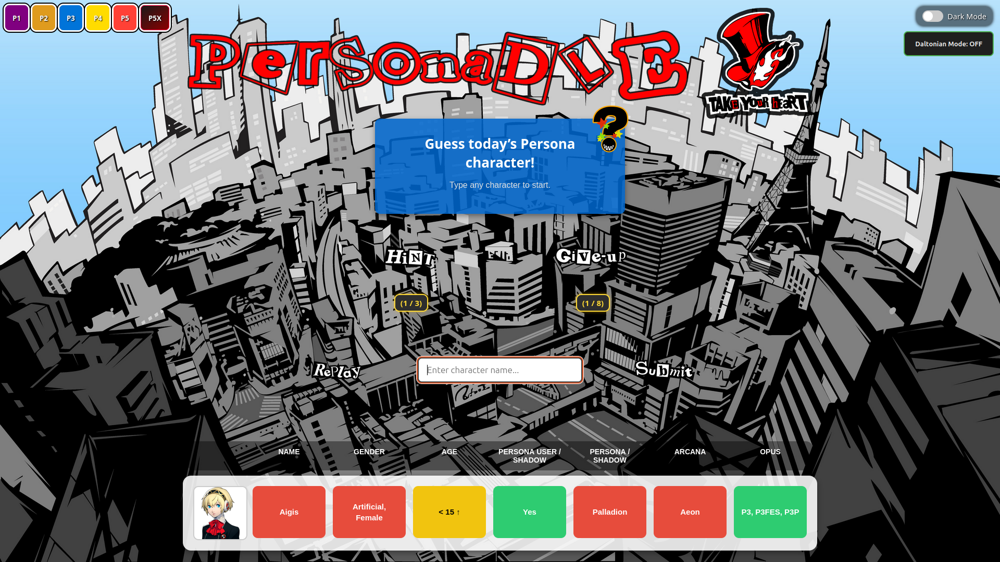
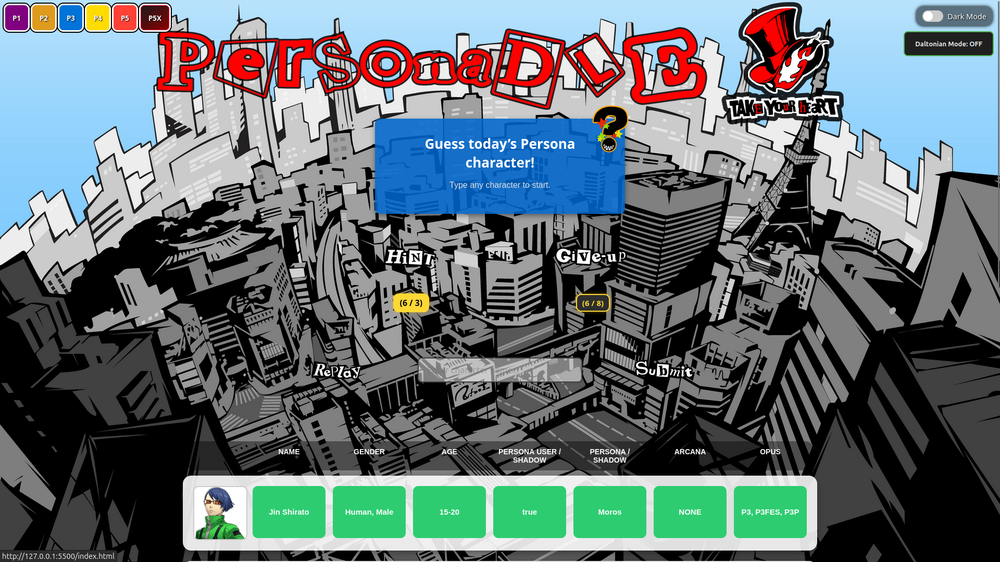
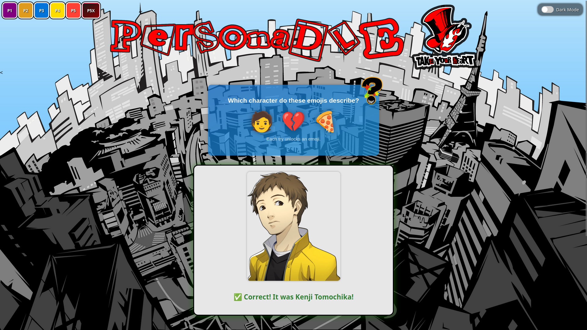
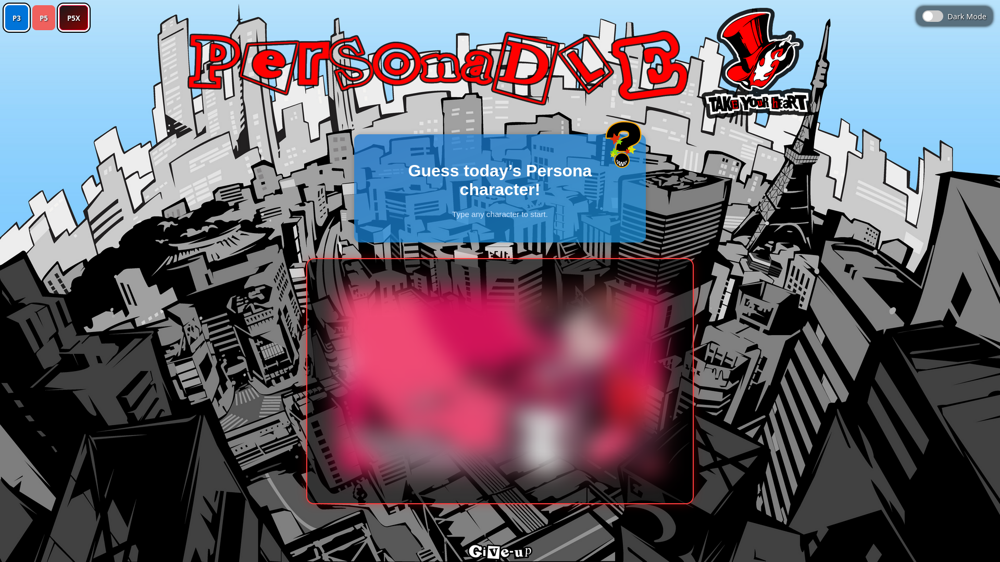
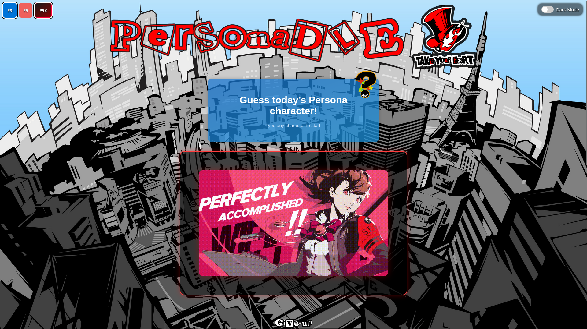
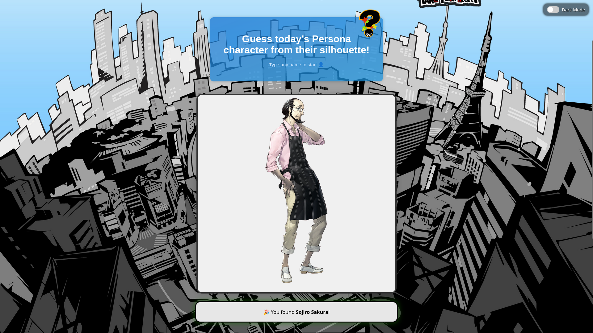
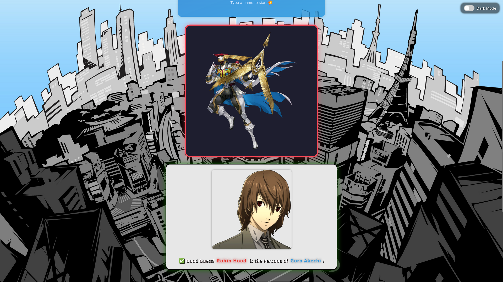
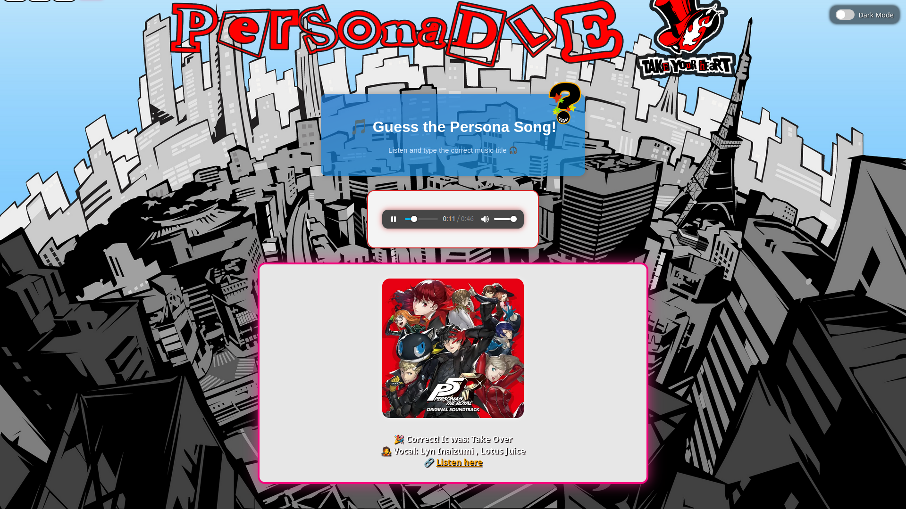

# 🎭 PERSONADLE

  

**A stylish daily guessing game set in the Persona universe.**  
Inspired by [Smashdle](https://smashdle.net), reimagined with the flair of **Persona** — from P1 to P5X.

Guess a new character each day through silhouettes, emojis, quotes, and more.  
Every game mode offers a unique challenge tailored to Persona fans, newcomers and veterans alike.

---

## 🧠 Concept

**Personadle** is a free, fan-made web game that celebrates the world of Persona.  
Your goal: **identify the daily character** by guessing based on the clues — visual, textual, logical, or symbolic — depending on the selected mode.

The entire experience is built for **daily play**, with memory of your progress and performance in each mode, plus stylish animations and Persona-inspired visuals.

---

## 🎮 Game Modes

1. 🧩 **Classic Mode**  
   Compare the guessed character's traits — Arcana, gender, age, game, Persona, etc. — with color-coded feedback and symbols. Each attempt gives detailed clues to help you narrow down the target.

2. 😺 **Emoji Mode**  
   A series of emojis is revealed progressively. Use intuition and logic to link them to a Persona character. Be quick — the emoji chain gets weirder the longer you wait.

3. 🔥 **All-Out Attack Mode**  
   A battle animation (GIF) is revealed behind a blur. Each incorrect guess makes the image clearer. Recognize the attack pattern, pose, or costume!

4. 🖤 **Shadow Mode**  
   A mysterious black silhouette slowly zooms out with every wrong attempt. No blur — just pure outline. Visual recognition and character memory are key here.

5. 👥 **Personae Mode**  
   You’re shown a Persona. Your job? Guess who uses it. With multiple games and spin-offs, this one's for lore enthusiasts and Velvet Room veterans.

6. 🎵 **Music Mode**  
   A music snippet plays. Guess the character or the track it’s associated with. From boss themes to overworld ambiance — only the most attentive fans will prevail.

Each mode is carefully designed with:
- 🎯 Smart autocomplete (with portraits)
- 🔁 Filter persistence (your choices are remembered)
- 🧠 Unique logic & difficulty
- ✨ Fully custom animations and reveal systems

---

## ✨ Key Features

- 🎨 **Persona 5-inspired UI** with SVG menus, blur/zoom reveals, and stylized feedback
- 📆 **Daily challenge** system (auto-reset at midnight Paris time)
- 🔁 **Persistent filters** per mode (P1–P5X), auto-restored on refresh with instant reset logic
- 🧠 **Smart autocompletion** with portrait thumbnails and keyboard navigation
- 📱 **Fully responsive** on mobile, tablet, and desktop
- 🌙 **Dark mode** enabled by default
- 🟡 **Colorblind mode** available
- 🧑‍🎤 **Player profile system**:
  - 🎭 Choose your pseudo & avatar (with cropping)
  - 🏆 Track wins, give-ups, longest streak, and favorite mode
  - 📤 Export / import / reset your data locally
- 🧮 **Stats system per mode** with anti-duplicate protection and session time tracking

---

## 📊 Profile System Example

Each player gets a **local account** with:
- 💬 Editable pseudonym
- 🖼️ Custom avatar (upload & crop)
- 🟢 Total wins, 🔴 give-ups, 📈 streaks
- 🎮 Preferred game mode based on playtime
- ⏳ Daily session time tracking
- 🔐 Export / import / reset buttons (via JSON)

Stored in `localStorage` — **nothing is sent online**, it's 100% private.

---

## 🛠️ Tech Stack

Built entirely with **vanilla front-end technologies** — lightweight, fast, and framework-free:

- **HTML5** – semantic markup, accessible UI
- **CSS3** – animations, dark mode, responsive design
- **JavaScript (ES6+)** – modular logic, localStorage, dynamic UI
- **No dependencies**, no frameworks, no external calls — pure web magic

---

## 🚧 Roadmap

| Feature                         | Status     |
|---------------------------------|------------|
| All 6 Game Modes                | ✅ Done     |
| Local Profiles & Stats          | ✅ Done     |
| Colorblind Mode                 | ✅ Done     |
| Daily Reset System              | ✅ Done     |
| Mobile Optimizations            | ✅ Done     |
| Filter Persistence              | ✅ Done     |
| Stylized SVG UI (Persona 5)     | ✅ Done     |
| 🎯 Online Leaderboards           | 🔜 Planned  |
| 📊 Streak History / Share Stats | 🔜 Planned  |
| 🌍 Deployment (GitHub / Vercel) | 🔜 Planned  |

---

## 🧑‍💻 Authors

### **Hamza** – *Lead Developer*  
🎮 JavaScript logic, game engine, UI animations, profile system  
👨‍💻 *Computer Science student*  
🕶️ *Persona, JoJo, and UX design enthusiast*

---

### **Léo** – *Data & Design*  
📊 Character databases, portrait mappings, visual layout, mode balancing  
🎨 *Also a CS student*  
💡 *UI + database nerd with spreadsheet powers*

---

## 🖼️ Screenshots

### 🧩 Classic Mode

### 😺 Emoji Mode

### 🔥 All-Out Attack Mode

### 🖤 Shadow Mode

### 👥 Personae Mode

### 🎵 Music Mode

---

## 🛡️ License

This project is licensed under the [MIT License](./LICENSE.txt).  
You are free to use, modify, and redistribute the code for non-commercial use.  
Just credit the creators, and keep it stylish 🎭

---

## ⚠️ Disclaimer

**Personadle is an unofficial, fan-made game.**  
It is not affiliated with ATLUS, SEGA, or the Persona franchise.

All characters, music, and media referenced belong to their rightful owners.  
No assets are redistributed — only reinterpreted via minimal, original recreations for educational and fan purposes.

---

## 💖 Support the Project

If you enjoy Personadle:

- 🌟 Star the repo on GitHub
- 📢 Share it with fellow Persona fans
- ☕ Support the devs when donation links go live!

Thank you for playing — and don’t forget to guess today’s character! 🎭

---

## 🙏 Credits & Thanks

- 💡 Inspired by **[SmashDLE](https://smashdle.net/)** by *Pimeko*
- 👨‍💻 Referenced structure from [Pokedle](https://github.com/maxm33/pokedle)
- 🎶 Persona series by **ATLUS / SEGA** — thank you for the universe

Let’s make every day a Metaverse mission!
