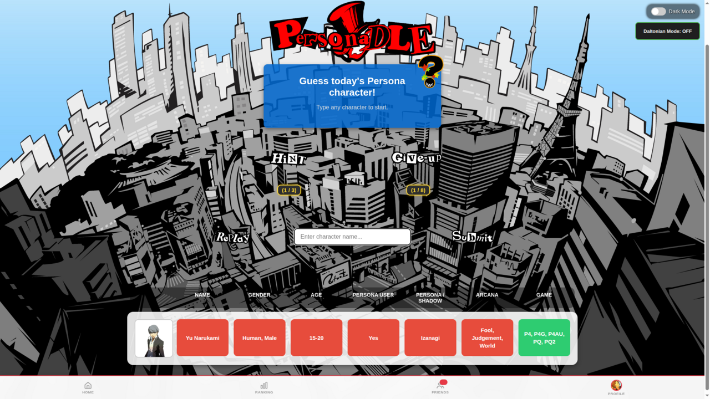
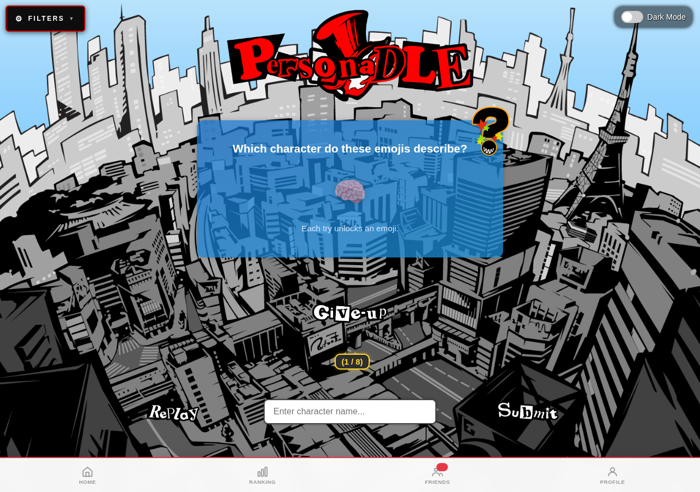
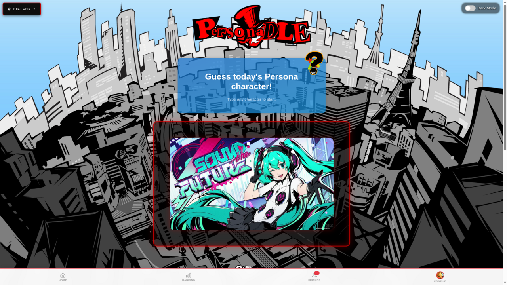
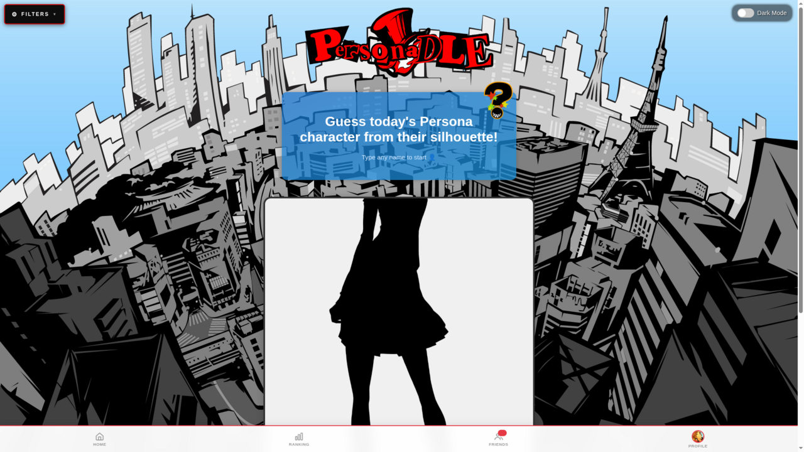
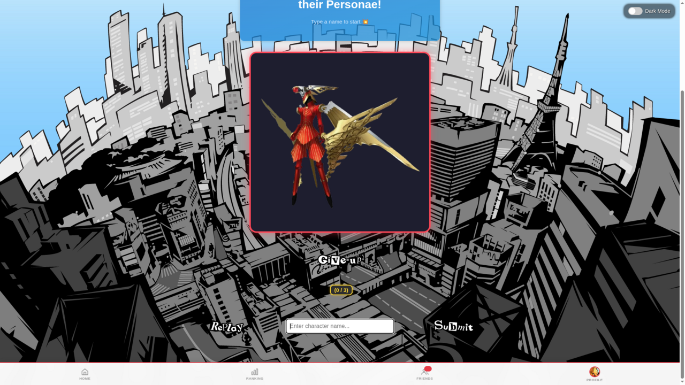
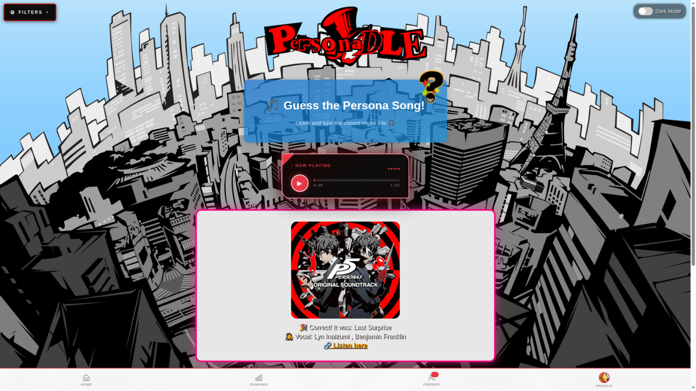

# 🎭 PERSONADLE

<p align="center">
  
</p>

<p align="center">
  <strong>A daily guessing game set in the Persona universe</strong>
  <br>
  <em>From Persona 1 to Persona 5X</em>
</p>

<p align="center">
  <a href="https://personadle.net"></a>
  <a href="LICENSE.txt"></a>
  
  
  
  
  
</p>

<p align="center">
  <a href="#-features">Features</a> •
  <a href="#-game-modes">Game Modes</a> •
  <a href="#-whats-new">What's New</a> •
  <a href="#-how-to-play">How to Play</a> •
  <a href="#-tech-stack">Tech Stack</a> •
  <a href="#-roadmap">Roadmap</a>
</p>

---

## 🎮 About

**Personadle** is a free, fan-made browser game celebrating the beloved Persona series (Persona 1-5X). Inspired by [Smashdle](https://smashdle.net), each day brings a new character to identify through various clue types—silhouettes, quotes, personas, emojis, music, and more.

Perfect for both long-time fans and newcomers to the series!

👉 **[Play now at personadle.net](https://personadle.net)**

---

## ✨ Features

<table>
  <tr>
    <td>🎖️ <strong>Badge System</strong></td>
    <td>Unlock 60+ unique achievements across 4 categories</td>
  </tr>
  <tr>
    <td>🖼️ <strong>Profile Card Sharing</strong></td>
    <td>Export your profile as a PNG — 8 themes, 25 wallpapers, share on X / Discord</td>
  </tr>
  <tr>
    <td>🔊 <strong>Sound Effects</strong></td>
    <td>Victory sounds and interactive button feedback</td>
  </tr>
  <tr>
    <td>🎨 <strong>Persona 5 UI</strong></td>
    <td>Stylish interface with SVG effects and dynamic transitions</td>
  </tr>
  <tr>
    <td>📊 <strong>Stats Tracking</strong></td>
    <td>Monitor wins, streaks, playtime, and favorite modes</td>
  </tr>
  <tr>
    <td>🌙 <strong>Dark Mode</strong></td>
    <td>Eye-friendly default theme with colorblind options</td>
  </tr>
  <tr>
    <td>🌐 <strong>Multi-language</strong></td>
    <td>5 languages: EN, FR, ES, DE, IT — auto-detected from browser</td>
  </tr>
  <tr>
    <td>👥 <strong>Friends System</strong></td>
    <td>Search by code, send requests, online status, P4 TV / Calling Card animations</td>
  </tr>
  <tr>
    <td>🏆 <strong>Leaderboard</strong></td>
    <td>Rankings by mode and period (weekly / monthly / all-time), friends scope</td>
  </tr>
  <tr>
    <td>💫 <strong>Social Link System</strong></td>
    <td>Ranks 1-10 (Stranger → True Confidant), XP, mutual actions, golden halo effect</td>
  </tr>
  <tr>
    <td>⚔️ <strong>Daily Challenges</strong></td>
    <td>Challenge friends to a specific mode and compare results</td>
  </tr>
  <tr>
    <td>☁️ <strong>Cloud Sync</strong></td>
    <td>Offline-first, PHP backend — progress synced automatically when online</td>
  </tr>
  <tr>
    <td>🔔 <strong>Notifications</strong></td>
    <td>Challenge results, friend requests, Social Link rank-ups</td>
  </tr>
  <tr>
    <td>🎵 <strong>Profile Music</strong></td>
    <td>Choose a Persona track that plays on your profile page</td>
  </tr>
  <tr>
    <td>🔰 <strong>Titles / Ranks</strong></td>
    <td>Unlock titles via stats (e.g. "Phantom Thief", "Wild Card"), equip one on your profile</td>
  </tr>
  <tr>
    <td>🎟️ <strong>Event Codes</strong></td>
    <td>Redeem limited-time codes for exclusive badges</td>
  </tr>
  <tr>
    <td>🛡️ <strong>Admin Panel</strong></td>
    <td>User moderation (ban, pseudo lock), event codes CRUD, stats dashboard</td>
  </tr>
</table>

---

## 🎯 Game Modes

### 🔍 Classic Mode
Compare character traits—Arcana, gender, age, game, Persona, etc.—with color-coded feedback (colorblind-friendly mode available). Each guess brings you closer!

### 😀 Emoji Mode
Decode a series of emojis that gradually appear. Use logic (and creativity) to link them to a character.

### ⚔️ All-Out Attack Mode
A blurred battle animation reveals step by step. Identify the pose, costume, or attack pattern!

### 🖤 Shadow Mode
A dark silhouette zooms out with each wrong guess. Test your visual memory!

### 👤 Personae Mode
Identify which character uses a specific Persona. Perfect for Velvet Room veterans!

### 🎵 Music Mode
Listen to short music clips and identify the character or theme. True fans will excel here!

<details>
<summary><strong>📸 View Screenshots</strong></summary>

<table>
  <tr>
    <td></td>
    <td></td>
  </tr>
  <tr>
    <td></td>
    <td></td>
  </tr>
  <tr>
    <td></td>
    <td></td>
  </tr>
</table>

</details>

---

## 🆕 What's New

<details open>
<summary><b>🚀 v2.0 - May 2026 (Latest)</b></summary>

### ☁️ Full Backend — PHP 8.3 + MariaDB
- Complete REST API with JWT-less auth (bcrypt + PHP sessions httpOnly)
- 20-table relational schema, 190+ unit tests (Vitest + jsdom)
- Cloud sync: offline-first, auto-sync on reconnect, migration from localStorage

### 👥 Friends & Social
- Friend system: search by pseudo or friend code, accept/decline, online status
- **Social Link** system — ranks 1-10 (Stranger → True Confidant), XP gained via real interactions
- True Confidant effect: pulsing golden halo + burst animation on rank 10
- Friend request animations: Persona 4 TV style, Persona 3 Evoker style, Calling Card style

### 🏆 Leaderboard & Challenges
- Leaderboard by mode × period (weekly / monthly / all-time), Global or Friends scope
- Daily challenges between friends — send, accept, compare results
- Notifications for challenge results and rank-ups

### 🎨 Profile Overhaul
- **Profile card export**: PNG image, 8 themes, 25 wallpapers, one-click share on X / Discord / Email
- Profile music: choose a Persona track that plays when friends visit your profile
- 60+ badges (server-side unlock verification), titles/ranks, event codes

### 🌐 Internationalisation
- 5 languages: EN · FR · ES · DE · IT (760 keys each)
- Auto-detected from browser, persisted in cloud account
- Localised buttons, messages, badge descriptions, titles

### 🛡️ Admin Panel
- User moderation (ban accounts, lock pseudos)
- Event codes CRUD (create, distribute, expire)
- Stats dashboard per user

</details>

<details>
<summary><b>🎊 v1.1 - February 2026</b></summary>

### 🧧 Chinese New Year Event
- **Limited-time All-Out Attack skins** celebrating the Lunar New Year
- **Exclusive seasonal wallpaper** and event badges
- Special rewards for discovering festive characters

### 🎭 Personae Mode - Expansion
- **8+ new ultimate personas** from P2, P3, P4G, P5R, and P5 Tactica
- **12 Picaro variants** - corrupted DLC personas join the roster
- Complete persona collection spanning the entire series

### 👤 New Characters
- Added **Persona 2 EP characters** to Classic, Emoji, and Silhouette modes
- Added **Velvet Room attendants** Belladonna and Demon Painter
- New **All-Out Attack skin** for Wonder
- Special guest appearance in Silhouette Mode

### 🎵 Music Mode Expansion
- **Persona 1 classics** make their debut
- **Persona 5X tracks** from the mobile spinoff
- **Persona Q & Q2 favorites** added to the jukebox
- Enhanced **Velvet Room collection** with multiple Aria of the Soul versions

### 🖼️ Profile Sharing
- **37 total wallpapers** now available across all Persona games
- New additions from P1, P2, P3, P4, P5, and Q series
- Iconic locations, character moments, and crossover artwork
- Seasonal and special event wallpapers

### 🎖️ Badge Collection
- **5+ new badges** added with hidden unlock conditions
- Achievement badges for character discoveries
- Secret badges for dedicated fans
- Event-exclusive badges with limited-time codes

### 🎨 UI & Polish
- Redesigned filter buttons and wallpaper selection interface
- **Emoji Mode improvement**: Error history now shows character portraits
- Consistent navigation across all game modes
- Enhanced mobile responsiveness

[View full changelog →](./PersonaDLE_Update_Documentation/PersonaDLE%201.1/PersonaDLE_Update_V2.pdf)

</details>

<details>
<summary><b>🎄 v1.0 - December 2025</b></summary>

### 🎖️ Badge System
- **19 unique badges** across 4 categories: Achievement, Event, Secret, and Social
- **Track your progress** with badge counter (e.g., "12/19 unlocked")
- **Showcase up to 4 badges** on your profile
- Unlock through gameplay, seasonal events, or hidden secrets!

### 🖼️ Profile Sharing
- **11+ custom wallpapers** featuring iconic Persona locations
- Share your stats, badges, and achievements
- Download as image or share directly on social media
- Customize with profile pictures including new additions: Chidori, Tae, and Maruki

### 🔊 Sound Effects
- Victory celebration sound on wins
- Hover feedback on all interactive buttons
- Enhanced immersion across all game modes

### 🌟 New Content
- Added **Fuuka Yamagishi** to All-Out Attack mode
- Added **Persona 5 Tactica characters**: Erina and Toshiro Kasukabe
- Complete character data for all modes

### ⚡ Performance & Improvements
- **All-Out Attack overhaul**: 66% faster load times, 40% less memory usage
- Progressive image loading with WebP format via CDN
- Smarter randomization to reduce character repetition
- Smoother experience on all devices

### 🐞 Bug Fixes
- Fixed Silhouette Mode image display issues
- Fixed Emoji Mode daily reset not triggering correctly
- Fixed Classic Mode data error (Yukino Mayuzumi opus)
- Fixed time tracking calculations
- Corrected Music Mode song titles
- Dark mode and UI polish

[View full changelog →](./PersonaDLE_Update_Documentation/PersonaDLE%201.0/PersonaDLE_Update.pdf)

</details>

## 🚀 How to Play

1. **Visit** [personadle.net](https://personadle.net)
2. **Create an account** (optional — enables cloud save, leaderboard, friends)
3. **Choose** your game mode
4. **Guess** the daily character using provided clues
5. **Play once per day** (resets at midnight Paris time)
6. Use **Replay** to try again or **Give Up** to see the answer

### Features:
- ✅ Smart autocompletion with character portraits
- ✅ Persistent game filters (P1 to P5X)
- ✅ Keyboard-friendly interface
- ✅ Cloud progress saving (with account) or local fallback
- ✅ Export/import data as JSON
- ✅ Challenge friends to your daily score

---

## 🛠️ Tech Stack

### Frontend

Built with **pure vanilla web technologies**—fast, lightweight, and dependency-free:

```
HTML5       → Semantic markup and accessible structure
CSS3        → Custom animations, responsive design, dark mode
JavaScript  → Modular ES6+, localStorage, dynamic UI
```

**No frontend frameworks. No external JS libraries.**

### Backend (v2.0)

```
PHP 8.3     → REST API, bcrypt auth, PDO prepared statements
MariaDB 10.6+ → 20-table relational schema (MySQL 8.0 compatible)
Apache      → .htaccess routing, CORS exact-origin, HTTPS
Hostinger   → Production hosting
```

API structure: `GET/POST/PATCH/DELETE /api/{resource}` — JSON responses, HTTP status codes.

### Tests

```
Vitest + jsdom → 190 unit tests (172 game logic + 18 backend integration)
npm test       → run all tests
```

### Browser Compatibility

| Browser | Version | Status |
|---------|---------|--------|
| Chrome  | 90+     | ✅ Supported (Best performance) |
| Firefox | 88+     | ✅ Supported |
| Safari  | 14+     | ✅ Supported (iOS 14+) |
| Edge    | 90+     | ✅ Supported |
| Opera   | 76+     | ✅ Supported |

**Requirements:**
- JavaScript enabled
- LocalStorage enabled
- 1280x720+ resolution recommended

---

## 📊 Profile System

Track your journey with comprehensive stats:

- **Custom Profile**: Editable username and avatar (with cropping)
- **Statistics**: Wins, give-ups, streaks, total playtime — per mode
- **Badge Collection**: 60+ unique achievements to unlock
- **Titles / Ranks**: Unlock via stats, one equipped at a time (e.g. "Phantom Thief", "Wild Card")
- **Profile Music**: A Persona track that plays when others visit your profile
- **Favorite Mode**: Automatically tracked based on playtime
- **Data Control**: Export, import, or reset your profile
- **Cloud Sync**: Linked to your account — survives browser clears

> ☁️ With an account, all data is synced to the cloud. Offline-first: the game works without a connection and syncs when you come back online.

---

## 🗺️ Roadmap

| Feature | Status | Contributor |
|---------|--------|-------------|
| All 6 Game Modes | ✅ Done | Hamza & Léo |
| Badge System (60+ badges) | ✅ Done | Hamza |
| Profile Sharing & Wallpapers | ✅ Done | Hamza |
| Sound Effects | ✅ Done | Hamza |
| Local Profiles & Stats | ✅ Done | Hamza |
| Colorblind Mode | ✅ Done | Hamza |
| Daily Reset System | ✅ Done | Hamza |
| Filter Persistence | ✅ Done | Hamza |
| Persona-style SVG UI | ✅ Done | Hamza |
| Full Responsive Layout | ✅ Done | Damien & Hamza |
| PHP Backend + MariaDB | ✅ Done | Hamza |
| Cloud Sync (offline-first) | ✅ Done | Hamza |
| Friends System + Social Link | ✅ Done | Hamza |
| Leaderboard (mode/period) | ✅ Done | Hamza |
| Daily Challenges | ✅ Done | Hamza |
| Multi-language (EN/FR/ES/DE/IT) | ✅ Done | Hamza |
| Profile Music | ✅ Done | Hamza |
| Profile Card Export (PNG) | ✅ Done | Hamza |
| Admin Panel | ✅ Done | Hamza |
| 190 Unit Tests | ✅ Done | Hamza |
| Mobile App (PWA) | 🔜 Planned | - |
| Japanese (JP) translation | 🔜 Post-v2.0 | - |

---

## 👥 Authors & Contributors

### Core Team

<table>
  <tr>
    <td align="center" width="25%">
      <br>
      <sub><b>Hamza Karrouchi</b></sub><br>
      <em>Founder & Lead Developer</em><br>
      <sub>Game logic, backend, animations, UI, profile system</sub><br>
      <sub>CS student & Persona/JoJo enjoyer</sub>
    </td>
    <td align="center" width="25%">
      <br>
      <sub><b>Léo (L2GENDAIRE)</b></sub><br>
      <em>Data & Design Lead</em><br>
      <sub>Character database, layout, portraits</sub><br>
      <sub>Spreadsheet wizard & UI enthusiast</sub>
    </td>
    <td align="center" width="25%">
      <br>
      <sub><b>Damien (Corbover)</b></sub><br>
      <em>Front-End Developer</em><br>
      <sub>CSS Architecture & Responsive Design</sub><br>
      <sub>Modularization specialist</sub>
    </td>
    <td align="center" width="25%">
      <br>
      <sub><b>Dzulian</b></sub><br>
      <em>Creative Consultant & Data Specialist</em><br>
      <sub>Ideas development & P1/P2 accuracy</sub><br>
      <sub>Classic trilogy preservation expert</sub>
    </td>
  </tr>
</table>

### 🌟 Special Thanks

**Active Contributors:**
- **Damien Nouvellon** - CSS restructuring and modularization for improved maintainability and responsive design preparation
- **Dzulian** - Creative ideas and data accuracy for Persona 1 & 2 (Megami Ibunroku, IS, EP)

---

## 🙏 Acknowledgments

### Inspiration
- **[Smashdle](https://smashdle.net/)** by *Pimeko* - Original concept inspiration
- **[Pokedle](https://github.com/maxm33/pokedle)** - Codebase reference

### Community
- **Arati** ([@Arati](https://x.com/Arati)) - Community support and featuring PersonaDLE
- **Discord Community** - Beta testing, bug reports, and endless feedback
- **Reddit r/persona4golden** - Support and suggestions

### Contributors & Development
- **Damien ( Corbover )** - CSS architecture restructuring and modularization
- **Dzulian** - Creative ideas and data accuracy for classic Persona games (P1/P2)
- All GitHub contributors who have helped improve the project

### Resources
- **[Megami Tensei Wiki](https://megamitensei.fandom.com/)** - Character data and lore
- **Atlus/SEGA** - For creating the incredible Persona universe
- **Shoji Meguro** - For the unforgettable music

---

## ⚖️ License

This project is licensed under the **MIT License** - see the [LICENSE.txt](LICENSE.txt) file for details.

You're free to use, modify, and share the code for **non-commercial use**—just credit the authors and keep it stylish! 😎

---

## ⚠️ Disclaimer

**PersonaDLE is a fan-made project** and is **not affiliated with, endorsed by, or connected to Atlus, SEGA, or the Persona franchise** in any way.

All characters, music, and references remain the property of their respective rights holders. No copyrighted assets are used—all visuals and audio are minimal recreations for educational and entertainment purposes.

### Regarding AI-Generated Assets

Some badges and wallpapers were created with AI assistance. As students working on this passion project for free in our spare time, we didn't have the budget or resources to commission artists. We deeply respect human artists and would prioritize working with them if PersonaDLE ever generates revenue or receives support.

---

## 🤝 Contributing

We welcome contributions! Here's how you can help:

1. **Report Bugs** - Found an issue? [Open an issue](https://github.com/HamzaKarrouchi/personadle/issues)
2. **Suggest Features** - Have an idea? We'd love to hear it!
3. **Join the Community** - Share your achievements and help others
4. **Spread the Word** - Share PersonaDLE with fellow Persona fans!

### Development Setup

```bash
# Clone the repository
git clone https://github.com/HamzaKarrouchi/personadle.git
cd personadle

# Install test dependencies
npm install

# Run the 190 unit tests
npm test

# Backend setup (first time only — creates DB, imports schema, configures Apache)
bash setup.sh

# Check i18n key coverage across all 5 languages
npm run i18n:check

# Open in browser — no build step required
# With backend: http://localhost/personadle/
```

### Want to Join the Team?

We're always looking for passionate contributors! Whether you're a developer, designer, or just a Persona fan with ideas, feel free to reach out.

**Current Focus Areas:**
- New game mode ideas
- Performance optimization
- Accessibility improvements
- Japanese (JP) translation (post-v2.0)

---

## 📞 Contact & Community

- 🌐 **Website**: [personadle.net](https://personadle.net)
- 🐙 **GitHub**: [HamzaKarrouchi/personadle](https://github.com/HamzaKarrouchi/personadle)
- 💬 **Discord**: [PersonaDLE](https://discord.gg/wpMdGGDp3y)
- 📧 **Contact**: Open an issue on GitHub for support or collaboration

---

## 📈 Stats

<p align="center">
  
  
  
  
</p>

---

<p align="center">
  <strong>"I am thou, thou art I… And together, we'll reach the truth."</strong>
  <br><br>
  Made with ❤️ by fans, for fans
  <br>
  <em>If you enjoy PersonaDLE, please support the official Persona games by purchasing them from Atlus/SEGA!</em>
</p>

---

<p align="center">
  <sub>Last updated: May 2026 • Version 2.0</sub>
</p>
