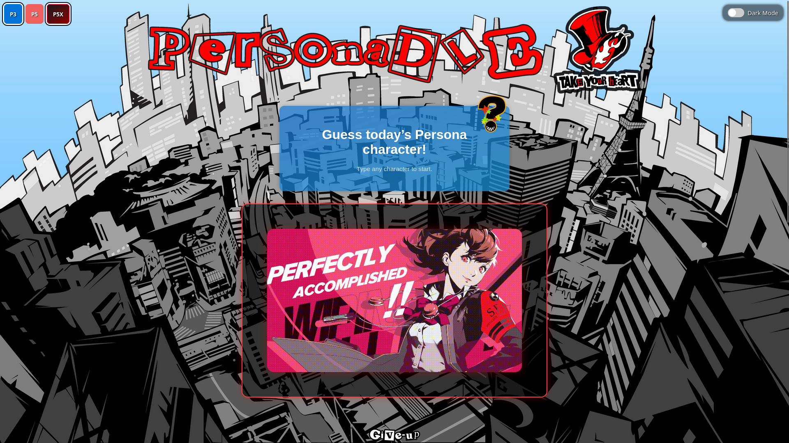
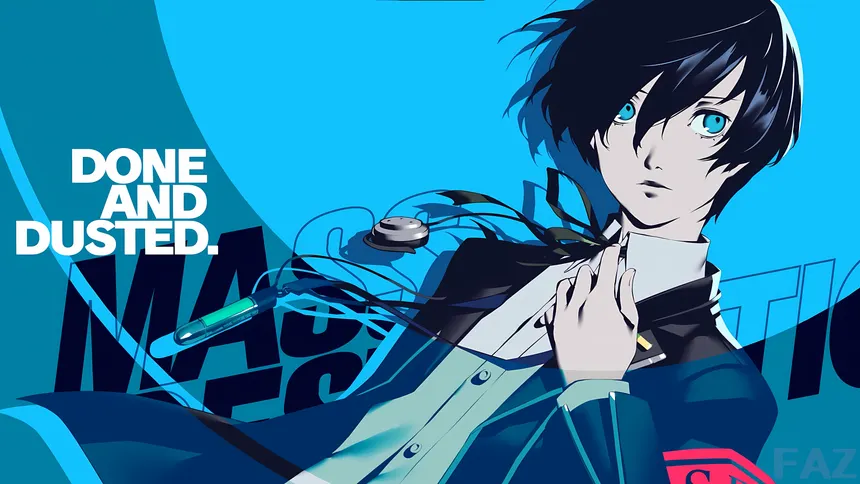
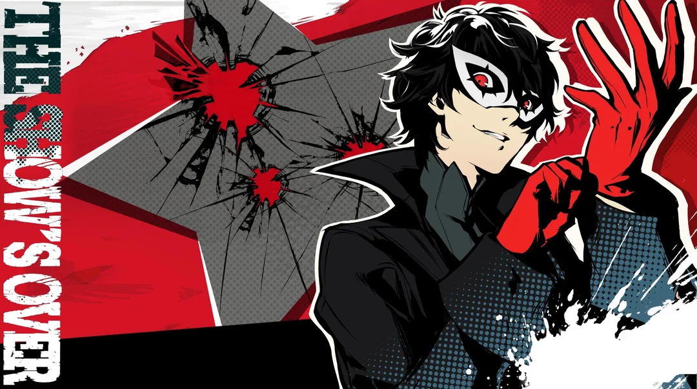
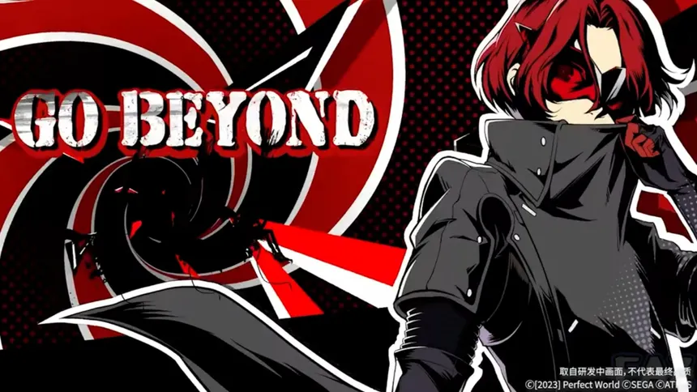

<div align="center">

# 💥 All-Out Attack Mode


> **Un GIF d'All-Out Attack est lancé. Mais qui mène la charge ?**

</div>

---

## 🎮 Principe du jeu

1. Un GIF animé d'All-Out Attack emblématique de la saga Persona s'affiche.
2. Le joueur tape le nom du personnage qui lance l'attaque.
3. **Pas de révélation progressive** — l'image reste identique jusqu'à la fin.
4. Après **3 mauvaises réponses**, le bouton Abandonner se déverrouille.

<div align="center">



*Écran de victoire — le personnage est révélé*

</div>

---

## 🥷 Les protagonistes dans l'arène

Trois héros — trois générations. L'image floue, c'est ce que voit le joueur. L'image nette, c'est la récompense.

<table align="center">
  <tr>
    <th align="center">🎭 Makoto Yuki — P3R</th>
    <th align="center">🃏 Joker — P5R</th>
    <th align="center">⚡ Wonder — P5X</th>
  </tr>
  <tr>
    <td align="center" width="33%">
      <br>
      <sub>👁️ Vue du joueur</sub>
    </td>
    <td align="center" width="33%">
      <br>
      <sub>👁️ Vue du joueur</sub>
    </td>
    <td align="center" width="33%">
      <br>
      <sub>👁️ Vue du joueur</sub>
    </td>
  </tr>
  <tr>
    <td align="center">⬇️</td>
    <td align="center">⬇️</td>
    <td align="center">⬇️</td>
  </tr>
  <tr>
    <td align="center">
      <br>
      <sub>✅ Après victoire</sub>
    </td>
    <td align="center">
      <br>
      <sub>✅ Après victoire</sub>
    </td>
    <td align="center">
      <br>
      <sub>✅ Après victoire</sub>
    </td>
  </tr>
</table>

---

## 🏗️ Structure du dossier

```
allOutAttackMode/
├── allOutAttack.html          ← page HTML du mode
├── allOutAttack.css           ← styles spécifiques
├── modeAllOutAttack.js        ← logique du jeu (module ES6)
└── database/
    ├── aoaCharacters.js         ← liste des personnages avec GIF
    ├── personas_allOut.js       ← données des personas associées
    ├── portraitsMap.js          ← correspondance nom → portrait
    └── [images GIF/WebP]        ← les GIFs d'All-Out Attack
```

---

## 🔧 `modeAllOutAttack.js`

Importe depuis `../js/gameCore.js` :
- `showConfettiExplosion` (style `"sides"`)
- `revealNextLink`, `setupRulesModal`, `setupDailyReset`, `checkResetOnLoad`
- `setupFilterButtons`
- `showWrongMini`

### ⚡ Système de cache LRU pour les GIFs

Les GIFs d'All-Out Attack sont des fichiers lourds. Ce mode implémente un **cache LRU** (_Least Recently Used_) en mémoire pour éviter de recharger les GIFs déjà vus :

```js
const IMAGE_CACHE_MAX = 20;  // max 20 GIFs en cache simultanément
const imageCache = new Map(); // clé = URL, valeur = Blob URL
```

| Fonction | Description |
|----------|-------------|
| `addToImageCache(url, blobUrl)` | Ajoute avec éviction du plus ancien si le cache est plein |
| `getFromCache(url)` | Retourne l'URL en cache ou `null` |
| `smartPreload(urls)` | Pré-charge les N prochains GIFs en arrière-plan |
| `loadImageSafely(url, imgEl, fallback)` | Charge avec gestion d'erreur |

### 🔀 Sélection anti-répétition

`getBetterRandomCharacter()` évite de tomber deux fois de suite sur le même personnage en maintenant un historique des **5 derniers** ciblés.

### 🏅 Badges spéciaux (`checkSpecialBadges`)

6 badges peuvent être débloqués dans ce mode, basés sur des personnages ou combinaisons spécifiques devinés. Vérifiés à chaque victoire via le profil `personaUserProfile` dans le `localStorage`.

### Fonctions spécifiques

| Fonction | Description |
|----------|-------------|
| `cdn(fichier)` | Construit l'URL complète du GIF depuis la base locale |
| `getFilteredPersonas()` | Filtre les personnages selon les opus actifs |
| `initializeAutocomplete()` | Dropdown avec filtrage par opus actif |
| `showVictoryBox()` | Affiche le panneau de victoire avec portrait et GIF |
| `updateGiveUpCounter()` | Met à jour le compteur d'essais restants |
| `disableInputs()` | Désactive les contrôles en fin de partie |
| `applyDarkModeStyles()` | Ajustements dark mode (couleur de fond du container GIF) |

---

## 🗄️ `database/` (local)

| Fichier | Contenu |
|---------|---------|
| `aoaCharacters.js` | Tableau des personnages avec leurs fichiers GIF |
| `personas_allOut.js` | Données complémentaires des Personas |
| `portraitsMap.js` | Correspondance nom → portrait pour les mauvaises réponses |

---

## 💾 localStorage utilisé

| Clé | Contenu |
|-----|---------|
| `allOutTarget` | Personnage cible (JSON) |
| `allOutAttempts` | Nombre d'essais |
| `allOutGameOver` | `"true"` si partie terminée |
| `filters_AllOutAttack` | Filtres opus actifs |
| `lastPlayedDate_AllOut` | Date de la dernière partie |

---

<div align="center">

---

### 🌫️ *Quelque chose se prépare dans le brouillard...*

> *Persona 4 Revival est en approche.*
> *Quand il émergera de l'autre côté, leurs All-Out Attacks rejoindront l'arène.*
>
> *Patience, détective.*

---

</div>
