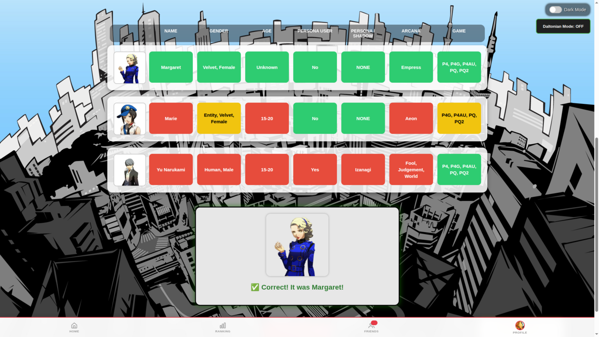

<div align="center">

# 🔍 Mode Classique


> **Devine le personnage en 7 attributs. Vert, jaune ou rouge — chaque réponse est un indice.**

</div>

---

## 🎮 Principe du jeu

1. Le joueur saisit un nom de personnage dans la barre de recherche.
2. Le jeu compare les 7 attributs du personnage proposé avec ceux du personnage cible.
3. Un tableau de comparaison apparaît avec un code couleur :
   - 🟩 **Vert** : attribut identique
   - 🟨 **Jaune** : correspondance partielle (intersection pour les tableaux, flèche pour l'âge)
   - 🟥 **Rouge** : attribut différent
4. Un bouton **Indice** se déverrouille après plusieurs essais.
5. Un bouton **Abandonner** se déverrouille après 5 mauvaises réponses.

<div align="center">


_Écran de victoire — le personnage est révélé avec sa citation officielle_

</div>

---

## 🎯 Les 7 attributs comparés

Ces attributs correspondent exactement aux champs utilisés dans `modeClassique.js` (`keysToCompare`).

<table>
  <thead>
    <tr>
      <th>Attribut</th>
      <th>Clé JS</th>
      <th>Type</th>
      <th>🟩 Vert</th>
      <th>🟨 Jaune</th>
      <th>🟥 Rouge</th>
    </tr>
  </thead>
  <tbody>
    <tr>
      <td><strong>Nom</strong></td>
      <td><code>nom</code></td>
      <td>Texte exact</td>
      <td>Même nom</td>
      <td>—</td>
      <td>Nom différent</td>
    </tr>
    <tr>
      <td><strong>Genre / Type</strong></td>
      <td><code>genre</code></td>
      <td>Tableau (ex: <code>["Human","Male"]</code>)</td>
      <td>Tableau identique</td>
      <td>Intersection partielle (ex: Human ✓ mais genre ✗)</td>
      <td>Aucun élément en commun</td>
    </tr>
    <tr>
      <td><strong>Âge</strong></td>
      <td><code>age</code></td>
      <td>Plage d'âge + flèche</td>
      <td>Même tranche (ex: 15-20 = 15-20)</td>
      <td>Tranche différente — ↑ cible plus âgée, ↓ cible plus jeune</td>
      <td>Âge inconnu / incomparable</td>
    </tr>
    <tr>
      <td><strong>Utilisateur de Persona</strong></td>
      <td><code>personaUser</code></td>
      <td>Booléen Oui / Non</td>
      <td>Même valeur</td>
      <td>—</td>
      <td>Valeur différente</td>
    </tr>
    <tr>
      <td><strong>Persona</strong></td>
      <td><code>persona</code></td>
      <td>Texte exact</td>
      <td>Même Persona</td>
      <td>—</td>
      <td>Persona différente</td>
    </tr>
    <tr>
      <td><strong>Arcane</strong></td>
      <td><code>arcane</code></td>
      <td>Tableau (ex: <code>["Chariot"]</code>)</td>
      <td>Arcane(s) identique(s)</td>
      <td>Arcane(s) en commun (personnages multi-jeux)</td>
      <td>Aucun arcane en commun</td>
    </tr>
    <tr>
      <td><strong>Jeu (Opus)</strong></td>
      <td><code>opus</code></td>
      <td>Tableau (ex: <code>["P5","P5R","P5S"]</code>)</td>
      <td>Exactement les mêmes jeux</td>
      <td>Au moins un opus en commun (ex: P5 ∩ {P5,P5R})</td>
      <td>Aucun opus en commun</td>
    </tr>
  </tbody>
</table>

> **Note** : Les champs `role`, `japanese` (VA), `dlc` existent dans `characters_clean.js` mais **ne sont pas comparés** dans ce mode. Seuls les 7 champs ci-dessus sont utilisés.

---

## 🧩 Exemple — une partie commentée

**Cible du jour : `Ryuji Sakamoto`.** On part de loin et on resserre, essai après essai.
_(🟩 identique · 🟨 partiel · 🟥 différent)_

<table>
  <thead>
    <tr>
      <th>Essai</th>
      <th>Genre</th>
      <th>Âge</th>
      <th>Pers. User</th>
      <th>Persona</th>
      <th>Arcane</th>
      <th>Opus</th>
    </tr>
  </thead>
  <tbody>
    <tr>
      <td><br><sub><b>Makoto Yuki</b></sub></td>
      <td align="center">🟩<br><sub>Human, Male</sub></td>
      <td align="center">🟩<br><sub>15-20</sub></td>
      <td align="center">🟩<br><sub>Oui</sub></td>
      <td align="center">🟥<br><sub>Orpheus</sub></td>
      <td align="center">🟥<br><sub>Fool…</sub></td>
      <td align="center">🟨<br><sub>P3… (PQ2 ✓)</sub></td>
    </tr>
    <tr>
      <td><br><sub><b>Yusuke Kitagawa</b></sub></td>
      <td align="center">🟩<br><sub>Human, Male</sub></td>
      <td align="center">🟩<br><sub>15-20</sub></td>
      <td align="center">🟩<br><sub>Oui</sub></td>
      <td align="center">🟥<br><sub>Goemon</sub></td>
      <td align="center">🟥<br><sub>Emperor</sub></td>
      <td align="center">🟩<br><sub>P5/P5R/P5S/P5T/PQ2</sub></td>
    </tr>
    <tr>
      <td><br><sub><b>Ryuji Sakamoto</b> 🎉</sub></td>
      <td align="center">🟩<br><sub>Human, Male</sub></td>
      <td align="center">🟩<br><sub>15-20</sub></td>
      <td align="center">🟩<br><sub>Oui</sub></td>
      <td align="center">🟩<br><sub>Captain Kidd</sub></td>
      <td align="center">🟩<br><sub>Chariot</sub></td>
      <td align="center">🟩<br><sub>P5/P5R/P5S/P5T/PQ2</sub></td>
    </tr>
  </tbody>
</table>

**Comment lire la progression :**

1. **Makoto Yuki** — bonnes bases (Human Male, 15-20, utilisateur de Persona 🟩), mais l'opus est 🟨 :
   il ne partage que **PQ2** avec la cible → on cherche donc plutôt côté **Persona 5**.
2. **Yusuke Kitagawa** — l'opus passe 🟩 (même set `P5/P5R/P5S/P5T/PQ2`), mais Persona et Arcane
   restent 🟥 → ce n'est pas lui, mais on est dans le bon groupe.
3. **Ryuji Sakamoto** — tout est 🟩 : **victoire !** Arcane Chariot, Persona Captain Kidd.

---

## 💬 Citations à la victoire

Chaque personnage possède une **citation officielle** révélée au moment de la victoire.
Les quotes sont stockées dans `../database/quotes.js` avec un fallback anglais systématique.

```js
// database/quotes.js
export const characterQuotes = {
  "Ryuji Sakamoto": {
    en: "You're a Phantom Thief now too, right?",
    fr: null, // fallback EN pour v2.0
  },
  "Yusuke Kitagawa": {
    en: "Art is an explosion!",
    fr: null,
  },
  // ...
};
```

> **Règle de traduction** : les quotes FR/ES/DE/IT utilisent exclusivement les **localisations officielles Atlus**. Aucune traduction libre n'est autorisée.

---

## Structure du dossier

```
classiqueMode/
├── classiqueMode.html   ← page HTML du mode
├── classique.css        ← styles spécifiques au mode
└── modeClassique.js     ← logique du jeu (module ES6)
```

---

## `classiqueMode.html`

Page principale du mode. Elle charge :

- `../css/global.css` — styles communs
- `./classique.css` — styles propres au mode
- `./modeClassique.js` via `<script type="module">`

Contient les éléments HTML :

- `#textbar` — champ de saisie avec autocomplete
- `#guessButton` — bouton Valider
- `#hintButton` — bouton Indice
- `#giveUpButton` — bouton Abandonner
- `#wrongGuessList` — liste des mauvaises réponses
- `#comparisonGrid` — tableau de comparaison des attributs
- `#victoryBox` — panneau de victoire
- `#rulesModal` — fenêtre modale des règles
- `#modeNavigationContainer` — navigation entre les modes

---

## `modeClassique.js`

Module ES6 principal du mode. Importe depuis `../js/gameCore.js` :

- `showConfettiExplosion` — animation de victoire
- `revealNextLink` — navigation vers le mode suivant
- `setupRulesModal` — câblage du modal
- `setupDailyReset` — reset automatique à minuit (Paris)
- `checkResetOnLoad` — détection d'un nouveau jour au chargement
- `setupFilterButtons` — gestion des filtres P3/P4/P5…
- `showWrongMini` — affichage des mauvaises réponses

### Logique spécifique au mode Classique

| Fonction                   | Description                                                                                       |
| -------------------------- | ------------------------------------------------------------------------------------------------- |
| `checkGuess()`             | Compare 7 attributs du personnage proposé au personnage cible et construit le tableau de couleurs |
| `filterCharacterPool()`    | Filtre la liste des personnages selon les opus actifs                                             |
| `convertAgeToValue()`      | Convertit l'âge en valeur numérique pour la comparaison (flèche ↑/↓)                              |
| `initializeAutocomplete()` | Dropdown de recherche avec portraits en miniature                                                 |
| `enableHintButton()`       | Active le bouton Indice après N essais                                                            |
| `enableGiveUpButton()`     | Active le bouton Abandonner après N essais                                                        |
| `applyDarkModeStyles()`    | Ajustements dark mode spécifiques à ce mode                                                       |

### Attributs comparés

| Attribut          | Type de comparaison                      |
| ----------------- | ---------------------------------------- |
| Jeu (opus)        | Exact / même saga                        |
| Arcane            | Exact                                    |
| Rôle              | Exact                                    |
| Âge               | Exact / plus grand / plus petit (flèche) |
| Genre             | Exact                                    |
| Doublage japonais | Exact                                    |
| DLC               | Exact                                    |

### Mode daltonien

Un mode daltonien est disponible : remplace les couleurs vert/rouge par des icônes ✓/✗ pour une meilleure accessibilité.

---

## localStorage utilisé

| Clé                      | Contenu                            |
| ------------------------ | ---------------------------------- |
| `classicTarget`          | Personnage cible (JSON)            |
| `classicAttempts`        | Nombre d'essais                    |
| `classicGameOver`        | `"true"` si la partie est terminée |
| `filters_Classic`        | Filtres opus actifs (JSON array)   |
| `lastPlayedDate_Classic` | Date de la dernière partie         |
