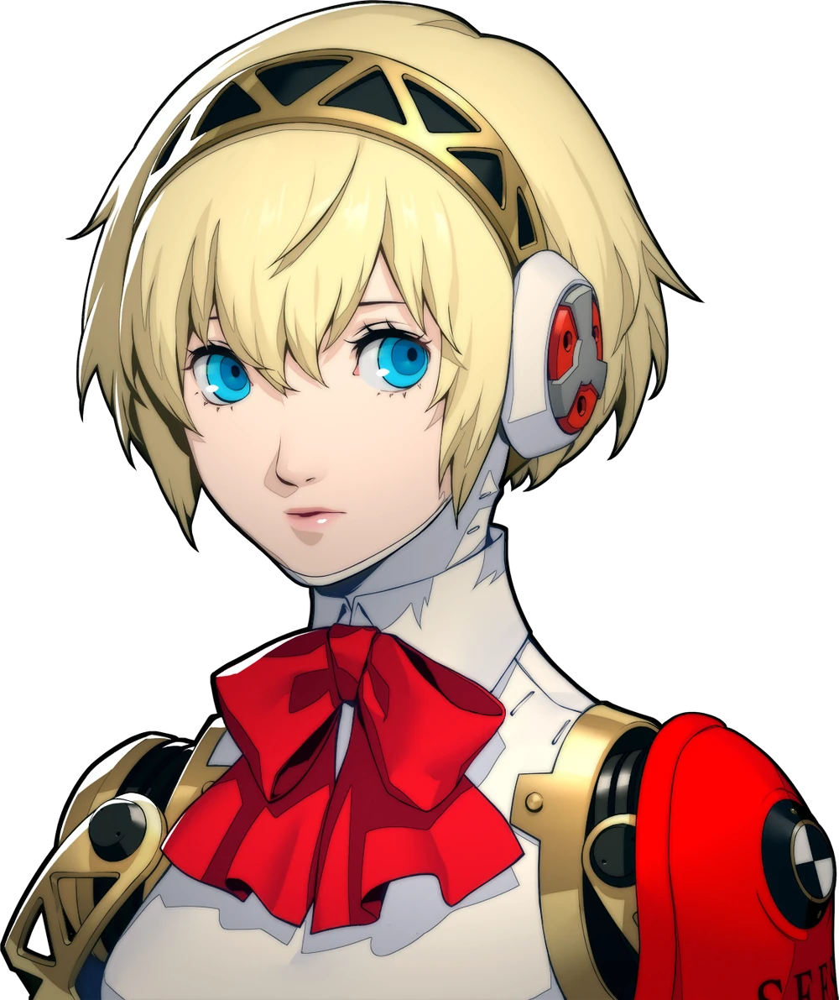

<div align="center">

# 🗄️ Base de données personnages

> **200+ personnages de P1 à P5X — organisés par opus, avec portraits, emojis et citations.**

</div>

Ce dossier contient les données des personnages utilisés dans le **mode Classique** ainsi que les portraits associés.
Les autres modes possèdent leur propre sous-dossier `database/` dans leur répertoire.

## Structure

```
database/
├── characters_clean.js   ← liste complète des personnages jouables
├── personas.js           ← données sur les Personas (mode Personae)
├── portraitsMap.js       ← correspondance nom → chemin d'image portrait
└── portraits/            ← images des personnages (.webp, 262+ fichiers)
    ├── Ren.webp
    ├── Yu.webp
    ├── Aigis.webp
    └── ...
```

---

## `characters_clean.js`

Tableau JavaScript exporté contenant **tous les personnages** disponibles dans le mode Classique.

### Structure d'un personnage

```js
{
  codename:  "Joker",           // Nom de code / surnom (affiché)
  realname:  "Ren Amamiya",     // Vrai nom du personnage
  opus:      "P5",              // Jeu d'origine (P1, P2IS, P3, P4, P5…)
  arcana:    "The Fool",        // Arcane de la Persona / Social Link
  role:      "Protagonist",     // Rôle dans l'histoire
  age:       "16",              // Âge (peut être "Unknown")
  sex:       "Male",            // Genre
  japanese:  "Yes",             // Doublage japonais disponible ?
  dlc:       "No",              // Personnage DLC ?
  portrait:  "Ren.webp"         // Nom du fichier dans portraits/
}
```

### Filtres opus disponibles

| Clé filtre | Jeux couverts |
|------------|---------------|
| `P1` | Persona 1 |
| `P2` | P2: Innocent Sin, P2: Eternal Punishment |
| `P3` | P3, P3 FES, P3 Portable, P3 Reload |
| `P4` | P4, P4 Golden, P4 Arena Ultimax, P4 Dancing |
| `P5` | P5, P5 Royal, P5 Strikers, P5 Tactica |
| `P5X` | Persona 5 The Phantom X |
| `PQ` | Persona Q, Persona Q2 |

---

## `portraitsMap.js`

Objet de correspondance `{ nomPersonnage: "chemin/vers/portrait.webp" }`.
Utilisé par le mode Classique pour afficher la bonne image lors d'une révélation.

---

## `portraits/`

Dossier contenant les portraits des personnages au format **WebP** pour un chargement optimisé.

Quelques exemples :

| Portrait | Personnage | Jeu |
|----------|-----------|-----|
|  | Ren Amamiya (Joker) | Persona 5 |
|  | Yu Narukami | Persona 4 |
|  | Aigis | Persona 3 |
|  | Ann Takamaki | Persona 5 |
|  | Mitsuru Kirijo | Persona 3 |

> **Note** : Les portraits sont la propriété d'Atlus / SEGA. Ils sont utilisés dans un contexte fan-made non commercial.

---

## Ajouter un personnage

1. Ajouter l'entrée dans `characters_clean.js` en respectant le format ci-dessus.
2. Déposer le portrait `.webp` dans `portraits/` avec le bon nom (doit correspondre au champ `portrait`).
3. Ajouter l'entrée dans `portraitsMap.js` si nécessaire.
4. Tester via la console du navigateur : `debugAllClassique()` (si disponible).
