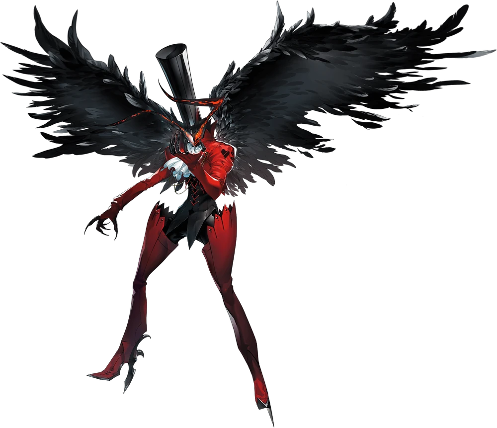
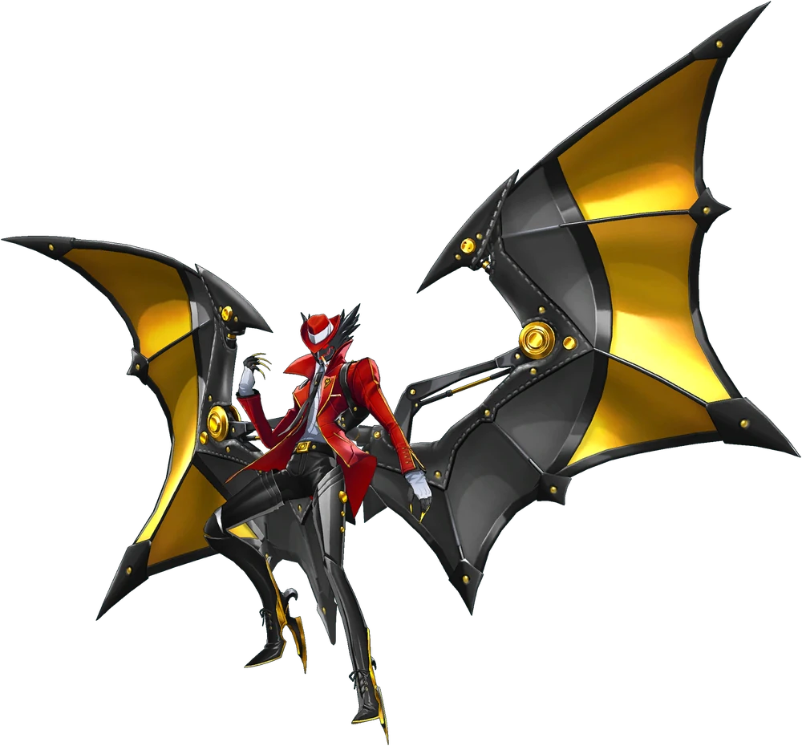
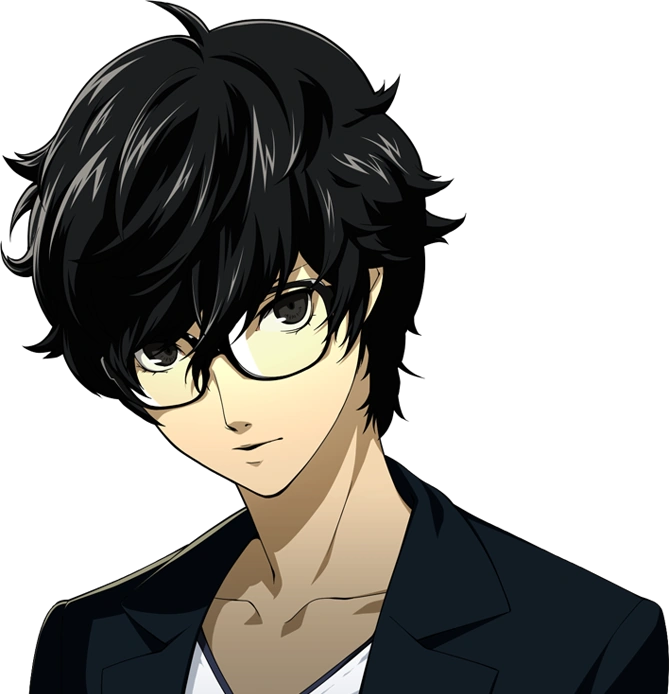
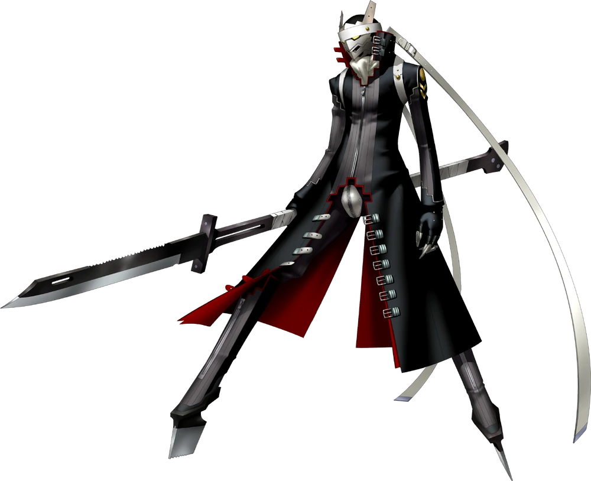
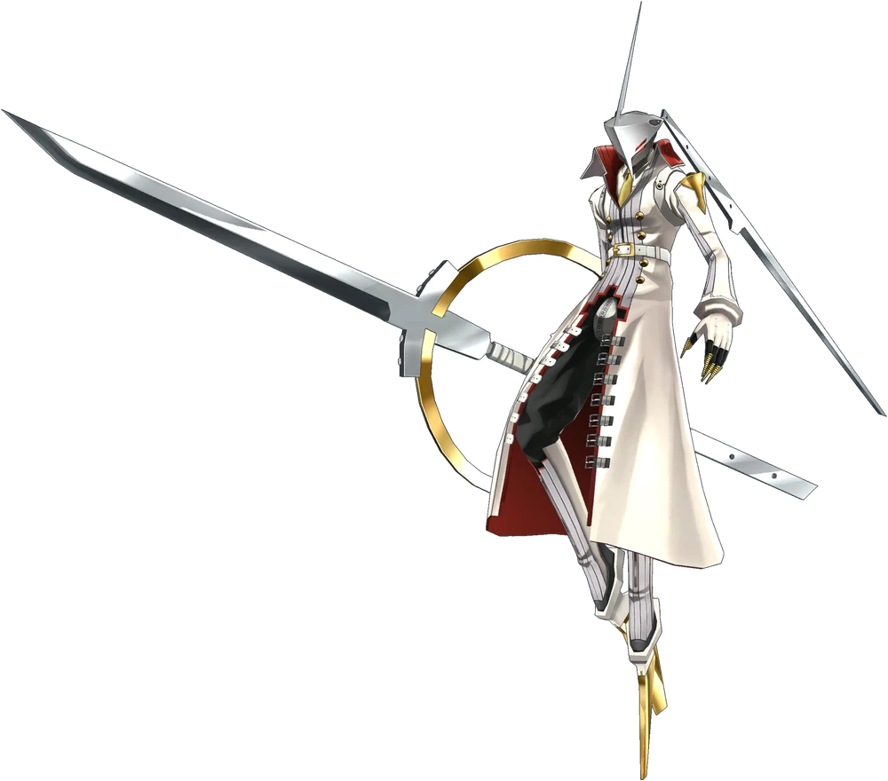
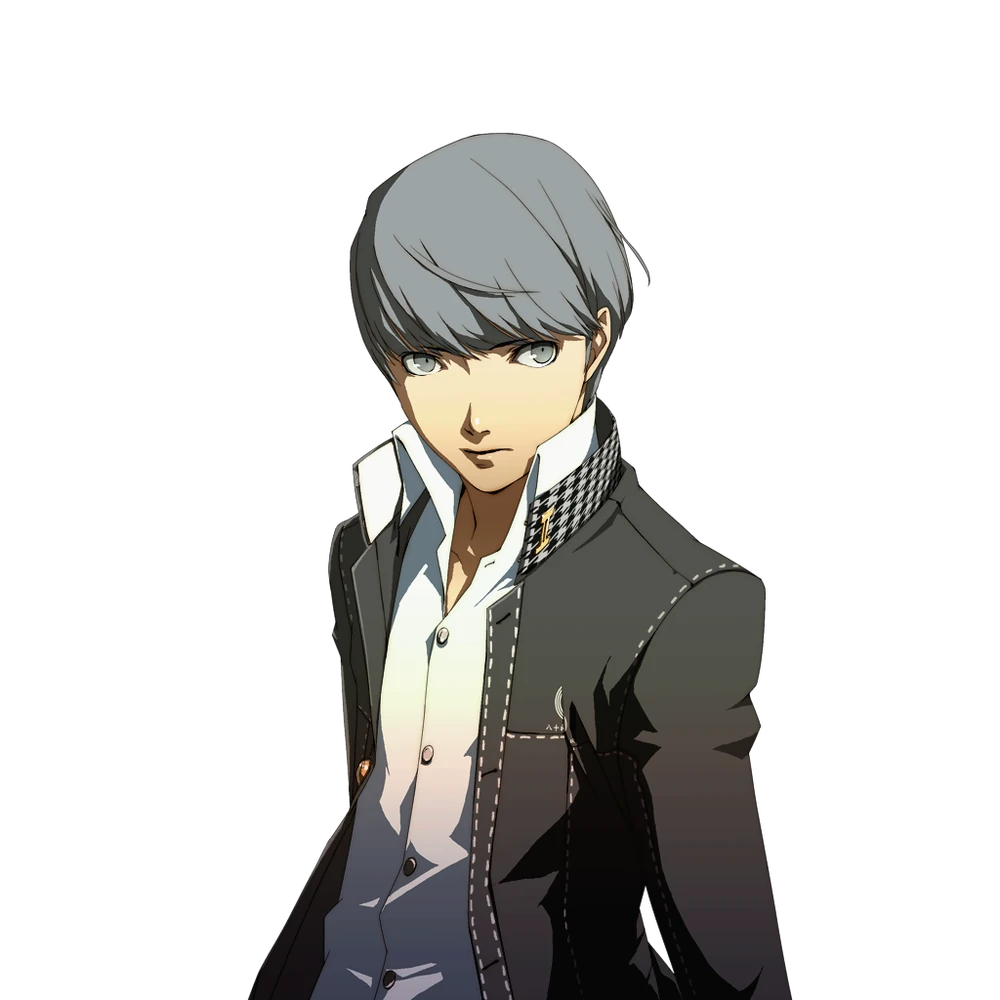
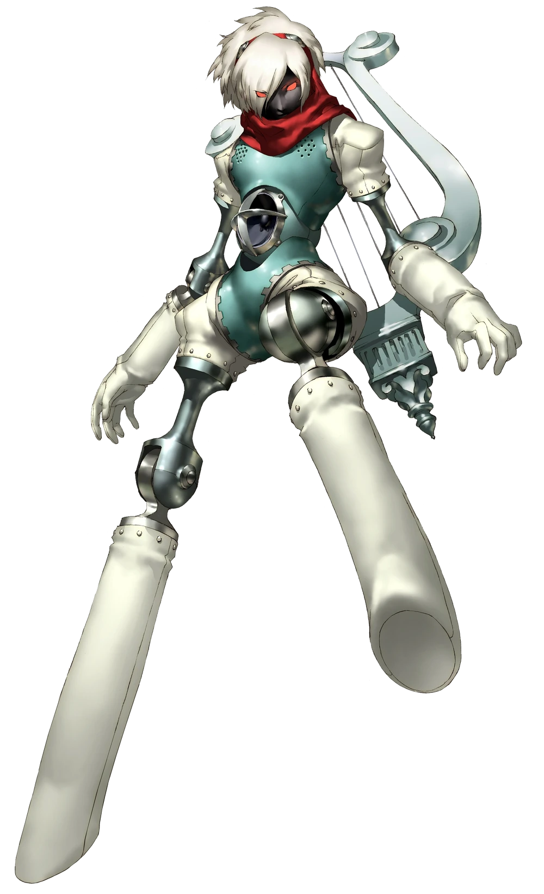
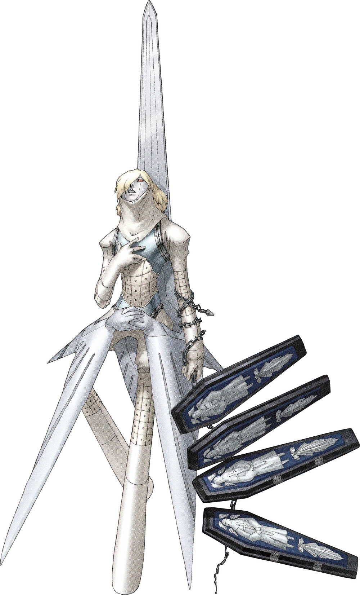

<div align="center">

# 🃏 Mode Personae


> **Ce n'est pas le joueur qu'on cherche — c'est l'entité qu'il invoque.**

</div>

---

## Principe du jeu

1. L'image d'une Persona est affichée (artwork officiel).
2. Le joueur saisit le nom de la Persona dans la barre de recherche.
3. Pas de tableau de comparaison — la mécanique est proche du mode Silhouette mais sans le masquage.
4. Après 3 mauvaises réponses, le bouton **Abandonner** se déverrouille.
5. Les **Personas Picaro** (variantes noires exclusives aux jeux crossover) sont incluses.

---

## 🃏 Personas vs Personnages — quelle différence ?

Dans la saga Persona, chaque protagoniste invoque une entité spirituelle appelée **Persona** — une manifestation de sa psyché, souvent inspirée de la mythologie ou du folklore mondial.

|                    | Personnage                        | Persona                      |
| ------------------ | --------------------------------- | ---------------------------- |
| **Exemple**        | Ryuji Sakamoto                    | Captain Kidd                 |
| **Ce qu'il est**   | Un humain du groupe               | L'esprit invoqué par Ryuji   |
| **Mode concerné**  | Mode Classique, Emoji, Silhouette | **Mode Personae**            |
| **Identificateur** | Nom, arcane, rôle, âge…           | Artwork officiel de l'entité |

> En mode Personae, on cherche **l'entité**, pas son porteur. Captain Kidd est la bonne réponse, pas Ryuji.

---

## 🎴 Exemples — quelle Persona, quel porteur ?

On voit l'**artwork d'une Persona**, on devine le **personnage** qui l'invoque. Beaucoup de héros
ont plusieurs Personas (forme initiale + forme ultime) — toutes pointent vers le même porteur.

<table>
  <tr>
    <td align="center">
      
      
    </td>
    <td align="center">➡️</td>
    <td align="center"><br><b>Ren Amamiya</b><br><sub>Arsène · Raoul</sub></td>
  </tr>
  <tr>
    <td align="center">
      
      
    </td>
    <td align="center">➡️</td>
    <td align="center"><br><b>Yu Narukami</b><br><sub>Izanagi · Izanagi-no-Okami</sub></td>
  </tr>
  <tr>
    <td align="center">
      
      
    </td>
    <td align="center">➡️</td>
    <td align="center"><br><b>Makoto Yuki</b><br><sub>Orpheus · Messiah</sub></td>
  </tr>
</table>

> En mode Personae, la **bonne réponse est le personnage** (Ren), pas le nom de la Persona.

---

## Structure du dossier

```
personaeMode/
├── personae.html              ← page HTML du mode
├── personae.css               ← styles spécifiques
├── modePersonae.js            ← logique du jeu (module ES6)
└── database/
    ├── personaeCharacters.js    ← liste des Personas disponibles
    ├── persona.js               ← données complètes des Personas
    ├── portraitsMapPersonae.js  ← correspondance nom → image
    └── img/                     ← artworks des Personas (WebP optimisé)
```

---

## `modePersonae.js`

Importe depuis `../js/gameCore.js` :

- `showConfettiExplosion` — avec `{ count: 30, spreadFrom: "bottom" }` (style montée du bas)
- `revealNextLink`, `setupRulesModal`, `setupDailyReset`, `checkResetOnLoad`
- `showWrongMini`

> **Confettis style "bottom"** : contrairement aux autres modes, les confettis montent du bas de l'écran en positions aléatoires, évoquant une invocation de Persona.

Le panneau de filtres opus est géré par `initFilterMenu` (`../js/filterMenu.js`), comme dans les
5 autres modes.

### Filtres disponibles

Les filtres permettent de limiter le pool de Personas par jeu d'origine. Les **Personas Picaro** sont un filtre séparé car elles n'appartiennent à aucun opus principal.

### Anti-répétition avec token

`pickCharacter()` utilise un **token de génération** (`_pickToken`) pour éviter les race conditions : si un nouveau personnage est sélectionné pendant le chargement d'un précédent (via filtre par exemple), le résultat obsolète est ignoré.

### Fonctions spécifiques

| Fonction                   | Description                                                             |
| -------------------------- | ----------------------------------------------------------------------- |
| `getFilteredCharacters()`  | Retourne les Personas selon les filtres actifs                          |
| `pickCharacter()`          | Sélectionne aléatoirement une Persona en excluant seulement la précédente |
| `initializeAutocomplete()` | Dropdown avec flag `_guessed` pour masquer les déjà proposées           |
| `showVictory()`            | Victoire avec badges, stats, confettis montants                         |
| `showWrong()`              | Affiche la vignette de la mauvaise Persona                              |
| `handleGuess()`            | Vérifie la saisie                                                       |
| `giveUp()`                 | Abandonne et révèle la bonne réponse                                    |
| `resetGame()`              | Remet à zéro et choisit une nouvelle Persona                            |
| `applyDarkModeStyles()`    | Ajustements dark mode                                                   |

---

## `database/` (local)

| Fichier                   | Contenu                                            |
| ------------------------- | -------------------------------------------------- |
| `personaeCharacters.js`   | Tableau des Personas jouables dans ce mode         |
| `persona.js`              | Données complètes (arcane, opus, variante Picaro…) |
| `portraitsMapPersonae.js` | Correspondance nom → chemin vers l'artwork         |
| `img/`                    | Artworks des Personas (WebP optimisé)              |

---

## localStorage utilisé

| Clé                       | Contenu                     |
| ------------------------- | --------------------------- |
| `personaeTarget`          | Persona cible (JSON)        |
| `personaeAttempts`        | Nombre d'essais             |
| `personaeGameOver`        | `"true"` si partie terminée |
| `personaeActiveFilters`   | Filtres opus actifs         |
| `lastPlayedDate_Personae` | Date de la dernière partie  |
