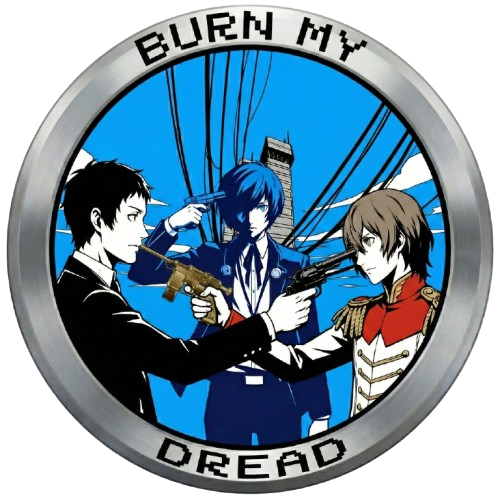
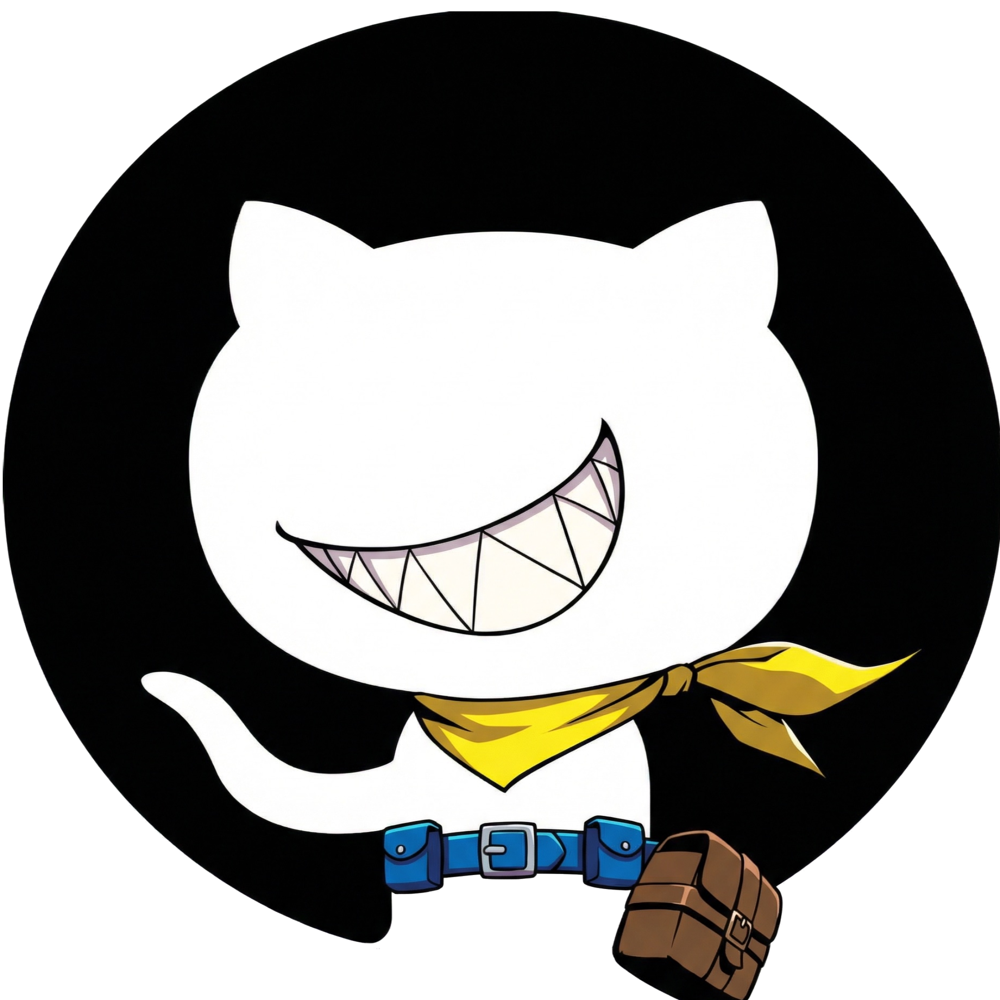
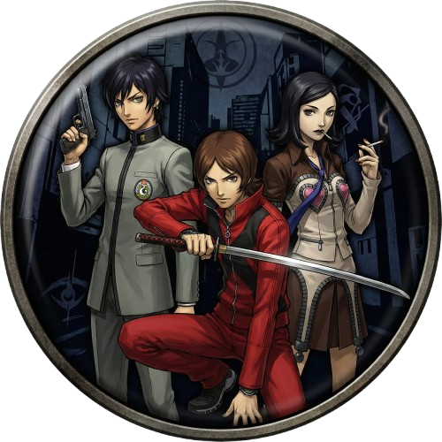
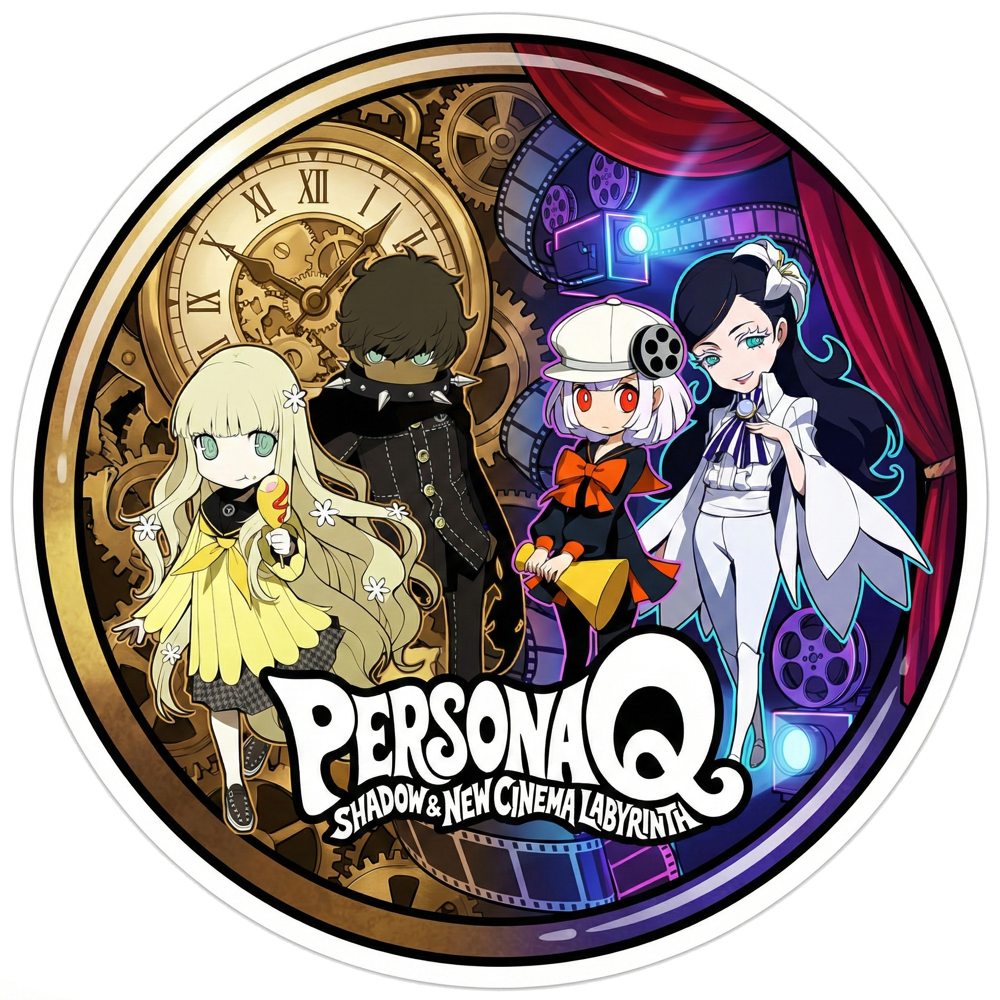
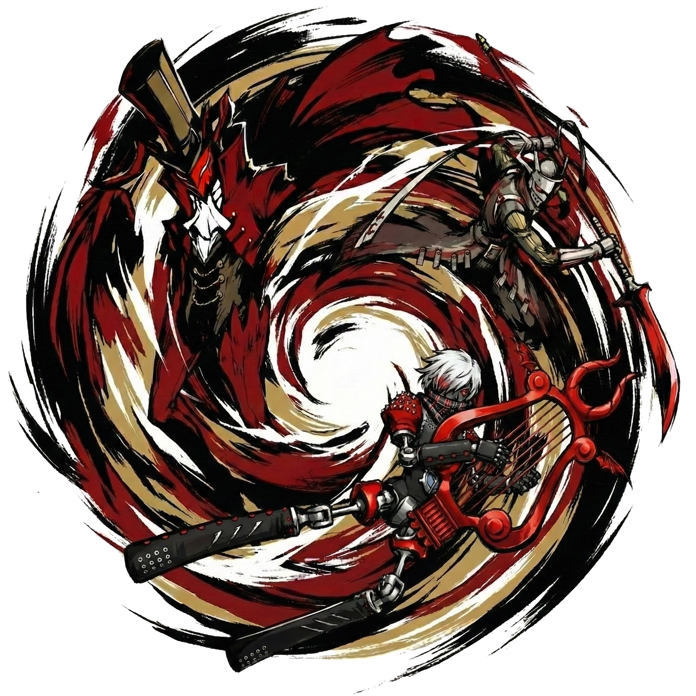
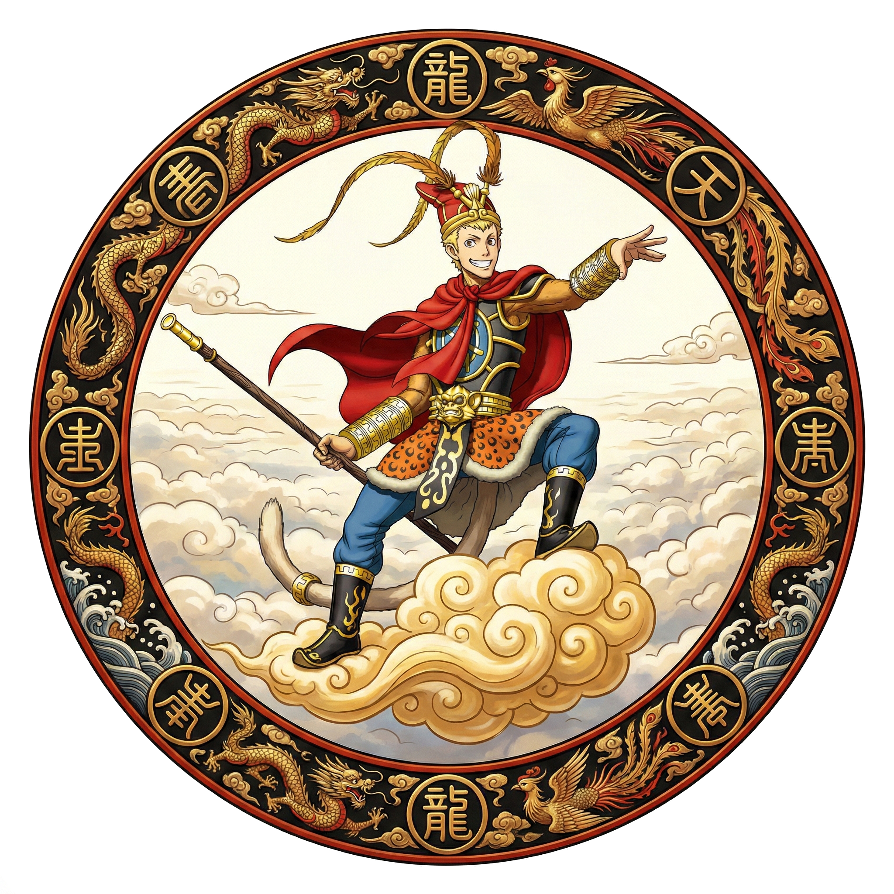
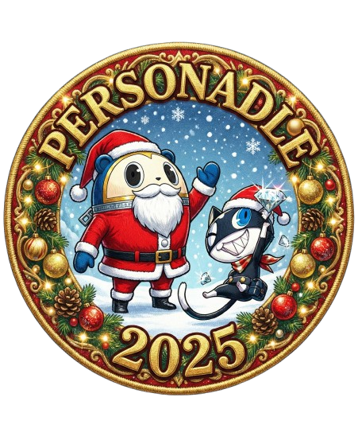

<div align="center">

# 👤 Profil Joueur

> **Statistiques, amis, Social Link, badges, titres — tout ce qui te définit comme joueur.**

</div>

Ce dossier gère l'ensemble du **système de profil joueur** : personnalisation (avatar, pseudo, fond d'écran), statistiques de jeu, collection de badges, système d'amis, leaderboard et Social Link.

---

## Structure

```
profile/
├── profile.html / profile-page.css / profile-page.js  ← page profil (affichage + éditeur)
├── profile.js           ← logique avatar, export JSON, crop canvas
├── profileStats.js      ← mise à jour des statistiques après chaque partie
├── profile-view.js      ← vue profil public d'un autre joueur
├── friends.html / friends.css / friends.js   ← système d'amis
├── leaderboard.html / leaderboard.css / leaderboard.js  ← classements
├── badges/
│   ├── badgesData.js    ← définition de tous les badges (conditions, images, textes)
│   ├── badgesManager.js ← vérification et attribution des badges (server-side v2.0)
│   ├── badges.css       ← styles des badges (grille, animations, états)
│   └── images/          ← icônes des badges (.png / .webp)
├── titles/              ← titres/rangs joueur débloquables
└── Wallpaper/           ← fonds d'écran disponibles pour le profil (37+)
```

---

## `profile.js` — Page profil

Le profil joueur est accessible depuis la page d'accueil. Il affiche :
- **Avatar** : image de profil choisie parmi les avatars du dossier `img/avatar/`
- **Pseudo** : nom d'affichage personnalisable
- **Fond d'écran** : image de fond choisie parmi les wallpapers disponibles
- **Statistiques globales** : nombre de parties, victoires, abandons, temps moyen
- **Collection de badges** : badges débloqués avec leur description
- **Titre équipé** : un titre/rang affiché sous le pseudo (ex. "Phantom Thief")
- **Musique de profil** : une piste Persona lue lors de la visite du profil

Les données sont synchronisées avec le backend (cloud-first) ; `localStorage` sert de fallback hors connexion.

### Structure du profil (cloud)

```js
{
  pseudo:      "Joker",
  avatar:      "Ren.webp",
  wallpaper_id: 3,
  equipped_title_id: 7,
  profile_music_id: 12,

  // Statistiques par mode (depuis user_stats BDD)
  stats: {
    Classic:    { wins: 12, giveups: 1, games: 15, streak: 4, streak_record: 7 },
    Emoji:      { wins: 5,  giveups: 0, games: 6,  streak: 2, streak_record: 5 },
    Silhouette: { ... },
    AllOut:     { ... },
    Personae:   { ... },
    Music:      { ... }
  },

  // Badges débloqués (depuis badges_unlocked BDD)
  badges: ["first_win", "burn_my_dread", "velvet_master", ...],
  selected_badges: ["first_win", "burn_my_dread", "twin_blade", "picaro"]
}
```

---

## ☁️ Cloud Sync

Le profil v2.0 est **source-of-truth backend** :

- `js/cloud-sync.js` — `pullProfileFromCloud()` écrase le localStorage depuis le serveur au login et toutes les 3 minutes
- `pushLangToCloud()` — le changement de langue est immédiatement synchronisé en BDD
- `js/auth.js` — dispatch des events `personadle:auth-login` / `personadle:auth-logout` sans rechargement de page
- Le jeu continue de fonctionner hors ligne ; la sync reprend au retour en ligne via `savePendingSession()`

---

## 👥 Système d'amis (`friends.html`)

La page amis permet :
- Rechercher un joueur par **pseudo** ou par **code unique d'ami**
- Envoyer, accepter, refuser ou supprimer une demande d'amitié
- Voir le statut en ligne (`last_seen_at`) de chaque ami
- Animations de demande d'ami : 📺 P4 TV · 🃏 Calling Card · 🔫 P3 Evoker (choix dans les paramètres)

### API utilisée

```
GET    /api/friends          → liste des amis + demandes en attente
POST   /api/friends          → envoyer une demande
PATCH  /api/friends/:id      → accepter / refuser
DELETE /api/friends/:id      → supprimer un ami
```

---

## 💫 Social Link System

Inspiré directement des jeux Persona : la relation entre deux amis progresse en **rang 1 → 10** via des interactions mutuelles.

### Rangs Social Link

| Rang | Nom | XP cumulés |
|------|-----|-----------|
| 1 | Stranger | 0 |
| 2 | Acquaintance | 100 |
| 3 | Companion | 250 |
| 4 | Ally | 450 |
| 5 | Confidant | 700 |
| 6 | Trusted Ally | 1 000 |
| 7 | True Ally | 1 350 |
| 8 | Bond | 1 750 |
| 9 | Unbreakable Bond | 2 200 |
| 10 | True Confidant | 2 700 |

### Actions qui génèrent de l'XP

| Action | XP solo | XP mutuel |
|--------|---------|-----------|
| Visiter le profil d'un ami | 5 | 10 |
| Partager son score du jour | 10 | 20 |
| Comparer ses stats | 10 | 20 |
| Envoyer / relever un défi | 15 | 35 |
| Partager sa streak | 15 | 30 |
| Jouer le même jour (auto) | 20 | 20 |

> **Rang 10 — True Confidant** : halo doré pulsant autour de l'avatar + burst de particules + label typewriter "✦ True Confidant" à chaque visite. Implémenté dans `css/rank10-effect.css` + `applyRank10Effect()` dans `js/social-link.js`.

---

## 🏆 Leaderboard (`leaderboard.html`)

Classements consultables par :
- **Mode** : Global (tous modes) · Classic · Emoji · Silhouette · AllOutAttack · Personae · Music
- **Période** : Hebdomadaire · Mensuel · All-time
- **Scope** : Tous les joueurs · Amis uniquement

```
GET /api/leaderboard?mode=Classic&period=weekly&friends_only=1
```

La réponse inclut `my_rank` pour afficher directement sa position sans paginer jusqu'à soi.

---

## 🔰 Titres / Rangs joueur (`titles/`)

Un titre est un texte affiché sous le pseudo sur le profil. Débloqué par conditions de stats.

| Titre | Condition | Rareté |
|-------|-----------|--------|
| Phantom Thief | 10 victoires Classic | Common |
| Wild Card | 50 victoires tous modes | Rare |
| Velvet Apprentice | Social Link rang 5 | Rare |
| True Phantom Thief | 100 victoires Classic | Epic |
| Thou Art I | Streak record ≥ 30 | Legendary |

```
GET /api/titles           → catalogue complet
POST /api/titles/unlock   → vérification côté serveur + déblocage
PATCH /api/user           → équiper un titre (equipped_title_id)
```

---

## `profileStats.js` — Mise à jour des stats

Exporté et appelé par chaque mode à la fin de partie :

```js
import { updateProfileStats } from "../profile/profileStats.js";

updateProfileStats({
  result:    "win",     // "win" | "giveup"
  mode:      "Music",   // Nom du mode
  timeSpent: 42         // Secondes passées sur la partie
});
```

Cette fonction envoie la session au backend via `savePendingSession()` (fire-and-forget, fallback localStorage si hors ligne).

---

## `badges/` — Système de badges

### `badgesData.js`

Définit la liste complète des badges disponibles. Chaque badge a :

```js
{
  id:          "foundBurnMyDread",       // Clé dans le profil
  name:        "Memento Mori",           // Nom affiché
  description: "Tu as trouvé Burn My Dread dans le mode Musique",
  image:       "Badges_Burn_My_Dread_Silver.png",
  condition:   (profile) => profile.foundBurnMyDread === true
}
```

### `badgesManager.js`

En v2.0, les conditions de déblocage sont **vérifiées côté serveur** (anti-triche). L'unlock est inscrit dans `badges_unlocked` en BDD via `GET /api/badges`. Le frontend appelle `syncBadgesWithBackend()` après chaque partie, puis re-rend la grille.

```js
// Appel dans chaque mode après victoire/abandon :
import("../profile/badges/badgesManager.js").then(module => {
  module.checkBadges(currentProfile, updatedProfile => {
    localStorage.setItem("personaUserProfile", JSON.stringify(updatedProfile));
  });
});
```

### Galerie des badges (sélection)

| Badge | Nom | Condition |
|-------|-----|-----------|
|  | Première Victoire | Gagner n'importe quel mode pour la première fois |
|  | Memento Mori | Trouver "Burn My Dread" en mode Musique |
|  | Hippocampus Reload | Trouver la collab ZUTOMAYO × P3R |
|  | Velvet Master | Maîtriser le mode Classique |
|  | Suivre Morgana | Trouver le dépôt GitHub |
|  | Ancien Combattant | Deviner un personnage de P1 ou P2 |
|  | Persona Q | Débloquer via le mode Silhouette |
|  | Twin Blade | Deviner Kaguya Picaro en mode Personae |
|  | Picaro | Deviner une Persona Picaro |
|  | Nouvel An Chinois | Badge événement saisonnier |
|  | Noël 2025 | Badge événement Noël |

> 60+ badges au total. La liste complète est dans `badgesData.js`. De nouveaux badges sont ajoutés à chaque mise à jour ou événement.

### `badges.css`

Contient les styles de la grille de badges :
- `.badge-grid` — disposition en grille responsive
- `.badge-card` — carte individuelle avec image + nom
- `.badge-card.locked` — badge non débloqué (opacité réduite, image grisée)
- `.badge-card.new` — animation de déverrouillage (flash doré)

---

## `Wallpaper/` — Fonds d'écran

Dossier contenant les images de fond utilisables dans le profil. 37+ wallpapers issus des différents jeux de la saga Persona. Le joueur peut en sélectionner un dans l'éditeur de profil. Les wallpapers sont gérés côté serveur depuis la v2.0 (table `wallpapers`, unlock vérifié en BDD).

---

## 🖼️ Export de la carte de profil

Le bouton **Share Profile** génère une image PNG exportable via `html2canvas` :
- 8 thèmes visuels
- 25 wallpapers Persona-thémés
- Boutons de partage : Download · X (Twitter) · Discord · Email
- Débloque le badge **Photographer** au premier export

Implémenté dans `js/calling-card.js` + `css/calling-card.css`.

---

## Données `localStorage` (fallback hors connexion)

| Clé | Description |
|-----|-------------|
| `personaUserProfile` | Objet JSON complet : pseudo, avatar, wallpaper, stats, flags badges |
| `personadle_lang` | Langue sélectionnée |
| `personaSettings` | Paramètres UI (dark mode, daltonien, style animation amis…) |

> En v2.0, `localStorage` est un cache local. La source de vérité est le backend. `pullProfileFromCloud()` écrase le cache à chaque login et toutes les 3 minutes.
