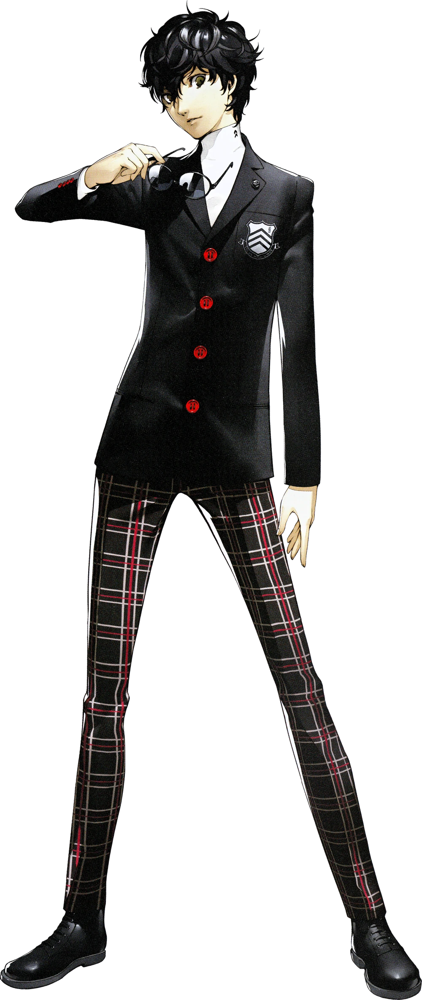
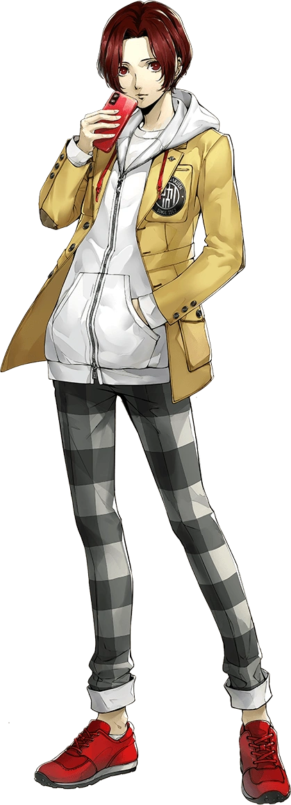
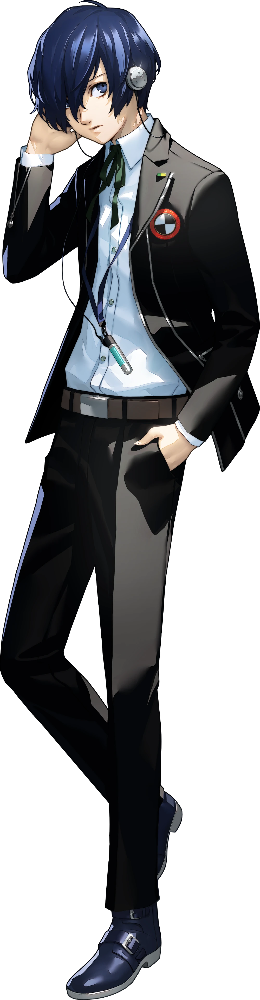

<div align="center">

# 🌑 Silhouette Mode


> **Un personnage se cache dans l'ombre. Sauras-tu le reconnaître avant qu'il soit trop tard ?**

</div>

---

## 🎮 Principe du jeu

1. Un portrait est affiché entièrement masqué — **silhouette noire totale**.
2. À chaque mauvaise réponse, l'image se révèle progressivement (zoom out + luminosité augmente).
3. Le joueur peut deviner à tout moment ; plus il attend, plus la révélation est grande.
4. Après un certain nombre d'essais, le bouton **Abandonner** se déverrouille.

---

## 👁️ De l'ombre à la lumière

La même image — deux états. À gauche, ce que voit le joueur. À droite, la révélation.

<table align="center">
  <tr>
    <th align="center" width="50%">🌑 Silhouette initiale</th>
    <th align="center" width="50%">✅ Portrait révélé</th>
  </tr>
  <tr>
    <td align="center">
      
      <br><sub>Ren Amamiya (Joker) — P5R</sub>
    </td>
    <td align="center">
      
      <br><sub>Ren Amamiya (Joker) — P5R</sub>
    </td>
  </tr>
  <tr>
    <td align="center">
      
      <br><sub>Nagisa Kaneshiro (Wonder) — P5X</sub>
    </td>
    <td align="center">
      
      <br><sub>Nagisa Kaneshiro (Wonder) — P5X</sub>
    </td>
  </tr>
  <tr>
    <td align="center">
      
      <br><sub>Makoto Yuki — P3R</sub>
    </td>
    <td align="center">
      
      <br><sub>Makoto Yuki — P3R</sub>
    </td>
  </tr>
</table>

---

## 📊 Progression de révélation

Chaque mauvaise réponse dévoile davantage le portrait :

| Essais | État de l'image                                  |
| ------ | ------------------------------------------------ |
| 0      | ⬛⬛⬛⬛⬛ Silhouette totale — `brightness(0)`   |
| 1      | 🟫⬛⬛⬛⬛ Légère lueur — zoom réduit            |
| 2      | 🟧⬛⬛⬛⬛ Contours visibles                     |
| 3      | 🟨🟨⬛⬛⬛ Couleurs partielles                   |
| 4      | 🟩🟩🟩⬛⬛ Presque révélé                        |
| 5+     | 🟩🟩🟩🟩🟩 Révélation complète — `brightness(1)` |

---

## 🏗️ Structure du dossier

```
silhouetteMode/
├── silhouette.html            ← page HTML du mode
├── silhouette.css             ← styles spécifiques (filtres CSS silhouette, zoom)
├── modeSilhouette.js          ← logique du jeu (module ES6)
└── database/
    ├── silhouetteCharacters.js  ← liste des personnages disponibles dans ce mode
    ├── portraitsMapSilhouette.js ← correspondance nom → chemin portrait
    ├── persona.js               ← données personas pour le filtre PQ
    └── img/                     ← portraits silhouette (WebP)
```

---

## 🖼️ `silhouette.html`

Éléments HTML notables :

| Élément                          | Rôle                                                   |
| -------------------------------- | ------------------------------------------------------ |
| `#silhouetteContainer`           | Div contenant l'image avec `filter: brightness(0)` CSS |
| `#textbar`                       | Champ de saisie avec autocomplete                      |
| `#guessButton` / `#giveUpButton` | Actions principales                                    |
| `#wrongGuessList`                | Liste des mauvaises réponses                           |
| `#victoryBox`                    | Révélation finale avec portrait en couleur             |

---

## 🎨 `silhouette.css`

Styles spécifiques à l'effet silhouette :

- `filter: brightness(0)` → silhouette noire complète (état initial)
- `filter: brightness(1)` → révélation progressive pilotée par JavaScript
- `transform: scale()` → gestion du zoom par niveau d'essai
- Transition CSS douce entre chaque niveau de révélation

---

## 🔧 `modeSilhouette.js`

Importe depuis `../js/gameCore.js` :

- `showConfettiExplosion` (style `"sides"`)
- `revealNextLink`, `setupRulesModal`, `setupDailyReset`, `checkResetOnLoad`
- `showWrongMini`

> **Note** : Ce mode utilise sa propre fonction `setupFilterButtons` locale (pas la version partagée), car ses filtres mutent directement le tableau `activeFilters` avec `push/filter`, contrairement à la version partagée qui reconstruit le tableau depuis le DOM.

### Fonctions spécifiques

| Fonction                   | Description                                                                                    |
| -------------------------- | ---------------------------------------------------------------------------------------------- |
| `pickCharacter()`          | Choisit aléatoirement un personnage avec un token anti-race (évite les changements simultanés) |
| `applyZoom(level)`         | Ajuste le niveau de zoom et de luminosité de l'image selon le nombre d'essais                  |
| `showVictory()`            | Révèle l'image en couleur, déclenche les confettis et vérifie le badge PQ                      |
| `showWrong()`              | Affiche la vignette du mauvais personnage et réduit le zoom                                    |
| `handleGuess()`            | Vérifie la saisie et dispatche vers victoire ou mauvaise réponse                               |
| `giveUp()`                 | Révèle le personnage sans victoire                                                             |
| `resetGame()`              | Remet à zéro l'état et choisit un nouveau personnage                                           |
| `initializeAutocomplete()` | Dropdown avec filtre `_guessed` (personnages déjà proposés masqués)                            |

---

## 🗄️ `database/` (local)

Ce mode possède sa propre base de données locale séparée de la base globale `database/`, car les personnages disponibles sont un sous-ensemble avec des portraits spécifiques aux silhouettes.

| Fichier                     | Contenu                                                           |
| --------------------------- | ----------------------------------------------------------------- |
| `silhouetteCharacters.js`   | Tableau des personnages jouables en mode Silhouette               |
| `portraitsMapSilhouette.js` | Correspondance nom → chemin vers le portrait                      |
| `persona.js`                | Données des Personas (utilisées pour la vérification du badge PQ) |
| `img/`                      | Portraits spécifiques au mode Silhouette (WebP, fond transparent) |

---

## 💾 localStorage utilisé

| Clé                         | Contenu                     |
| --------------------------- | --------------------------- |
| `silhouetteTarget`          | Personnage cible (JSON)     |
| `silhouetteAttempts`        | Nombre d'essais             |
| `silhouetteGameOver`        | `"true"` si partie terminée |
| `silhouetteActiveFilters`   | Filtres opus actifs         |
| `lastPlayedDate_Silhouette` | Date de la dernière partie  |
